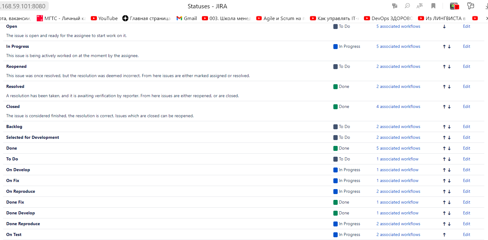

# Домашнее задание к занятию «Жизненный цикл ПО»

## Подготовка к выполнению
1. Используя docker скачал образ JIRA и установил ее локально 
2. Создал доски Kanban и Scrum:

## Решение основной части

Создал статусы для доски Kanban:

Создаю два Workflows согласно заданию:

Workflow для типов задач Bug:

Workflow для всех остальных типов задач:

Создаю задачу с типом Bug:

Довел задачу до состояния Done:

Создал задачу с типом Epic и две задачи с типом Task, привязанные к Epic,
Довел задачи до состояния Done:

Вернул задачи обратно в состояние Open:

Перехожу в Scrum проект, создаю задачи с эпиком и планирую спринт:

Довожу задачи до состояния выполнения и закрываю спринт:

## Выгруженные схемы Workflow:

* [bug workflow](https://github.com/Elfxf85/devops-netology/blob/main/09-CI-01-intro/Workflows/Bug.xml)
* [other workflow](https://github.com/Elfxf85/devops-netology/blob/main/09-CI-01-intro/Workflows/Other.xml)