# Домашнее задание к занятию «Teamcity»

## Подготовка к выполнению

1. В Yandex Cloud создайте новый инстанс (4CPU4RAM) на основе образа `jetbrains/teamcity-server`.
2. Дождитесь запуска teamcity, выполните первоначальную настройку.
3. Создайте ещё один инстанс (2CPU4RAM) на основе образа `jetbrains/teamcity-agent`. Пропишите к нему переменную окружения `SERVER_URL: "http://<teamcity_url>:8111"`.
4. Авторизуйте агент.
5. Сделайте fork [репозитория](https://github.com/aragastmatb/example-teamcity).
6. Создайте VM (2CPU4RAM) и запустите [playbook](./infrastructure).

## Подготовка к выполнению

1-4. В Yandex Cloud создал новые инстансы на основе образов `jetbrains/teamcity-server` и `jetbrains/teamcity-agent`, выполнил первоначальную настройку, авторизовал агент:

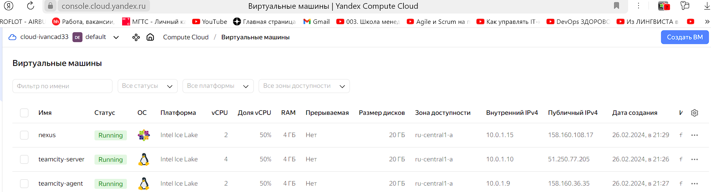

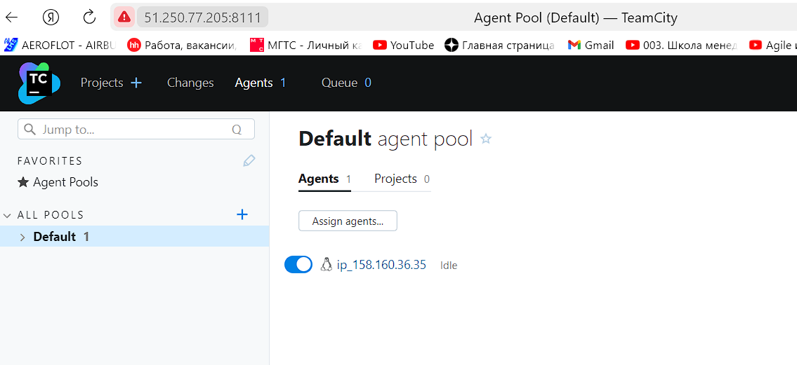

5. Сделал fork репозитория: https://github.com/Elfxf85/example-teamcity

6. Создал VM для Nexus и запустил playbook, Nexus запускается:

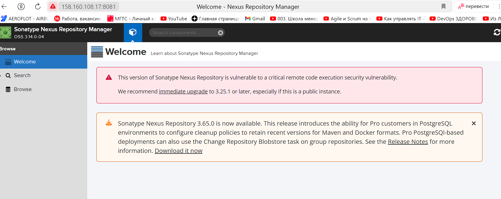

## Основная часть

1. Создайте новый проект в teamcity на основе fork.
2. Сделайте autodetect конфигурации.
3. Сохраните необходимые шаги, запустите первую сборку master.
4. Поменяйте условия сборки: если сборка по ветке `master`, то должен происходит `mvn clean deploy`, иначе `mvn clean test`.
5. Для deploy будет необходимо загрузить [settings.xml](./teamcity/settings.xml) в набор конфигураций maven у teamcity, предварительно записав туда креды для подключения к nexus.
6. В pom.xml необходимо поменять ссылки на репозиторий и nexus.
7. Запустите сборку по master, убедитесь, что всё прошло успешно и артефакт появился в nexus.
8. Мигрируйте `build configuration` в репозиторий.
9. Создайте отдельную ветку `feature/add_reply` в репозитории.
10. Напишите новый метод для класса Welcomer: метод должен возвращать произвольную реплику, содержащую слово `hunter`.
11. Дополните тест для нового метода на поиск слова `hunter` в новой реплике.
12. Сделайте push всех изменений в новую ветку репозитория.
13. Убедитесь, что сборка самостоятельно запустилась, тесты прошли успешно.
14. Внесите изменения из произвольной ветки `feature/add_reply` в `master` через `Merge`.
15. Убедитесь, что нет собранного артефакта в сборке по ветке `master`.
16. Настройте конфигурацию так, чтобы она собирала `.jar` в артефакты сборки.
17. Проведите повторную сборку мастера, убедитесь, что сбора прошла успешно и артефакты собраны.
18. Проверьте, что конфигурация в репозитории содержит все настройки конфигурации из teamcity.
19. В ответе пришлите ссылку на репозиторий.

---

## Решение основной части

1. Создал новый проект на основе fork:

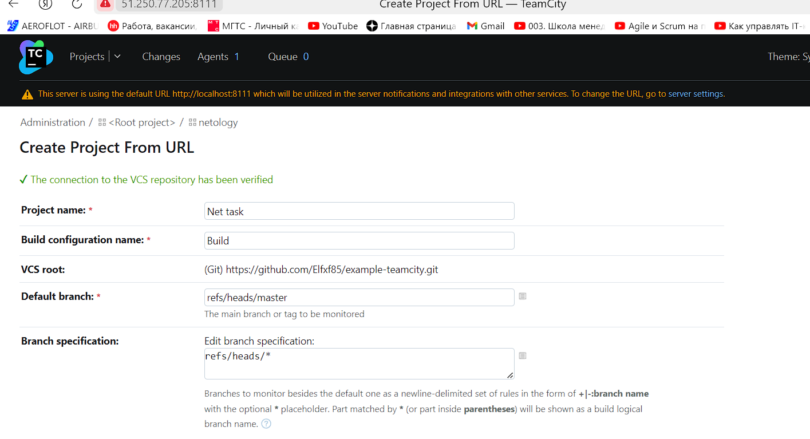

2. Выполнил autodetect конфигурации, тип проекта определил как Maven:

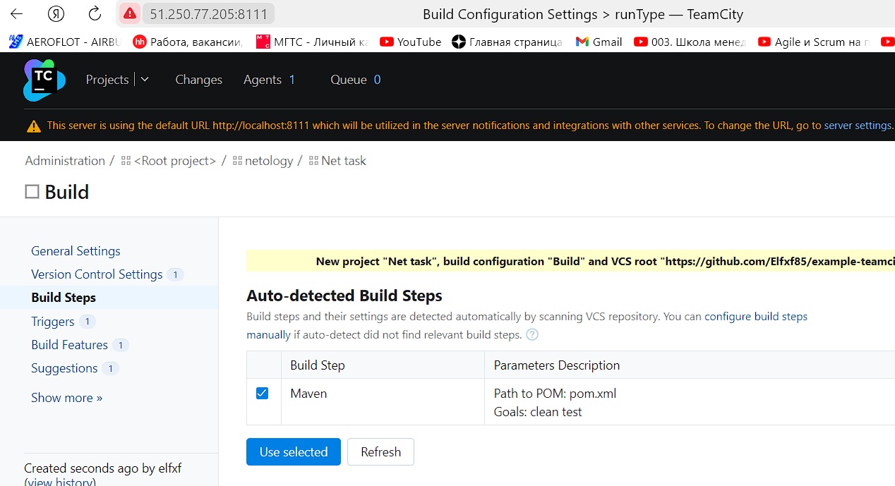

3. Запускаю сборку, сборка выполнена успешно:

4. Поменял условия сборки: если сборка по ветке `master`, то должен происходит `mvn clean deploy`, иначе `mvn clean test`:

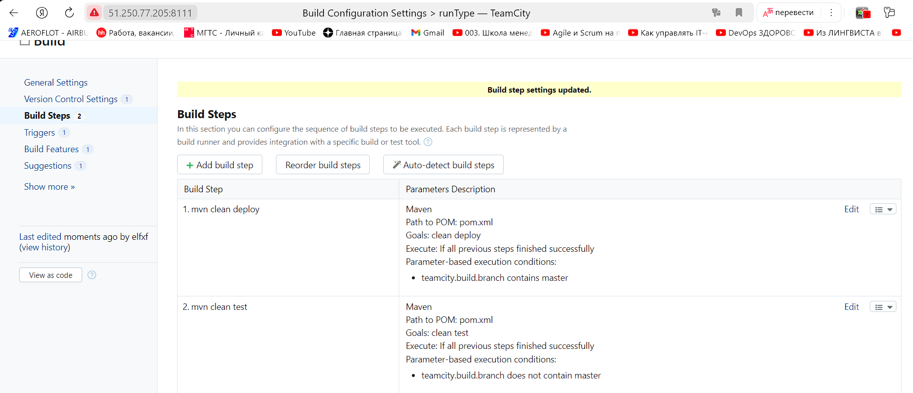

5. Загрузил `settings.xml` в набор конфигураций maven в teamcity, предварительно записав туда креды для подключения к Nexus:

6. В pom.xml репозитория изменил начальную версию и адрес nexus, запушил изменения.

7. Запустил сборку, сборка завершилась успешно и артефакт появился в Nexus:

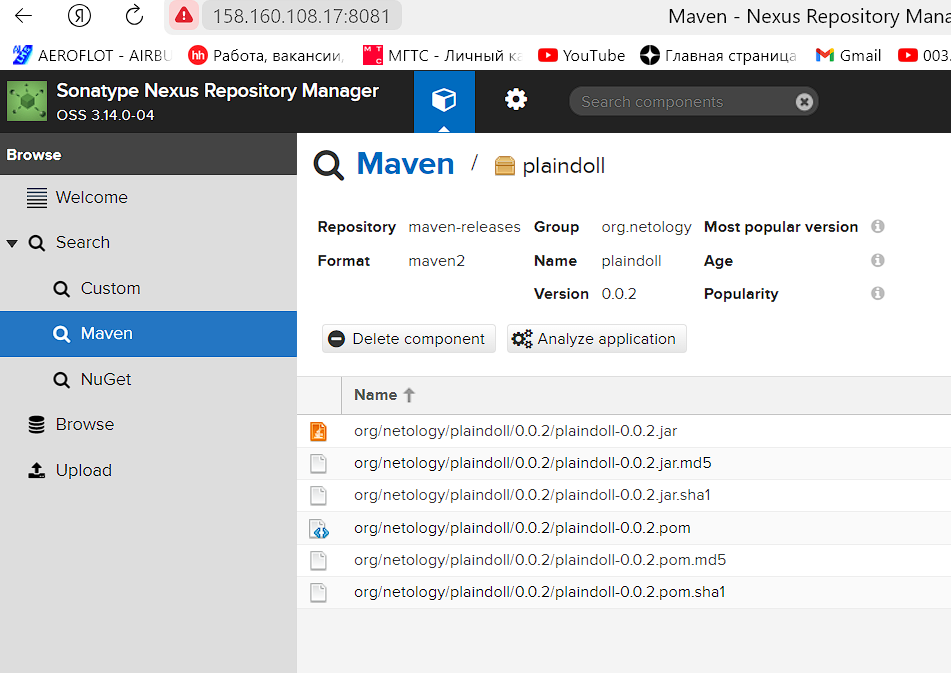

8. Мигрировал `build configuration` в репозиторий:

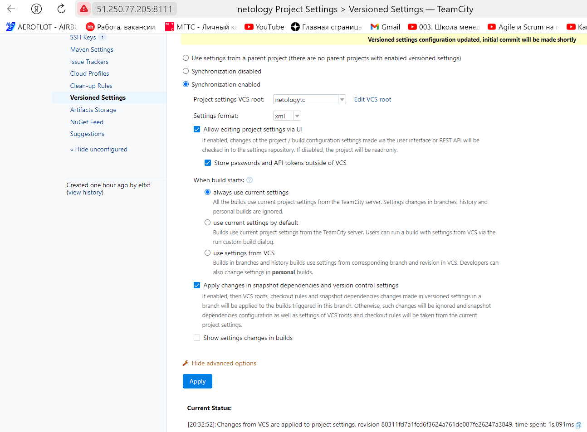

9. Создал отдельную ветку `feature/add_reply` в репозитории:

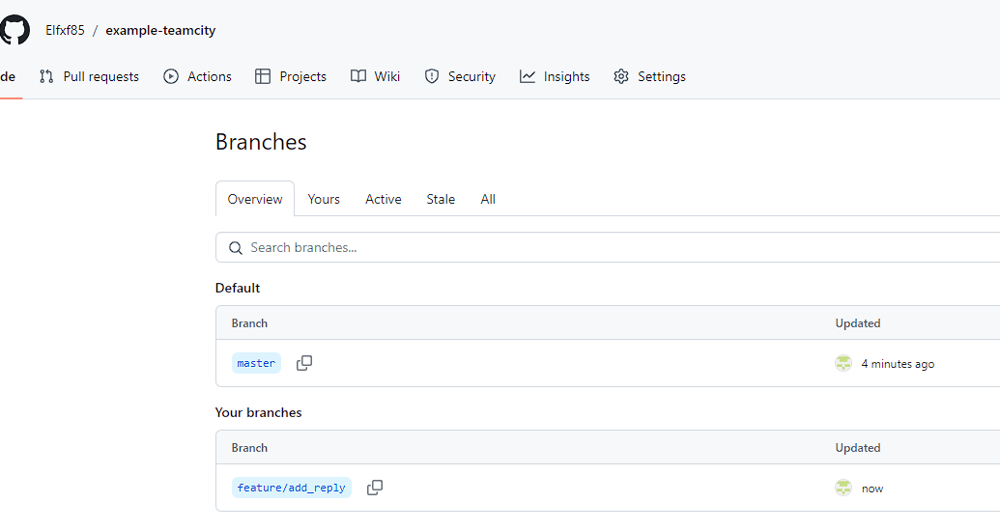

10. Написал новый метод для класса Welcomer с репликой, содержащей слово `hunter`:

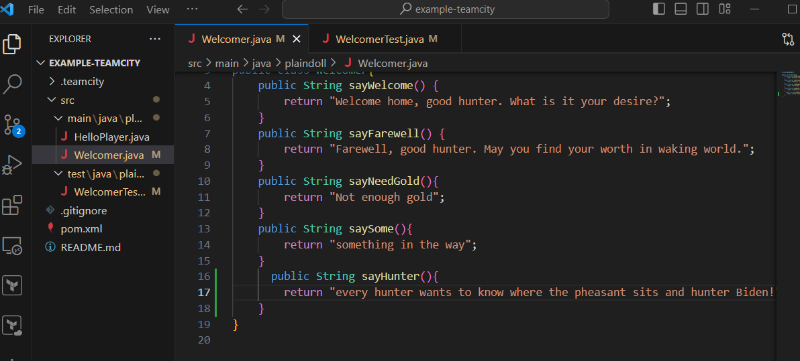

11. Дополнил тест для нового метода на поиск слова `hunter` в новой реплике:

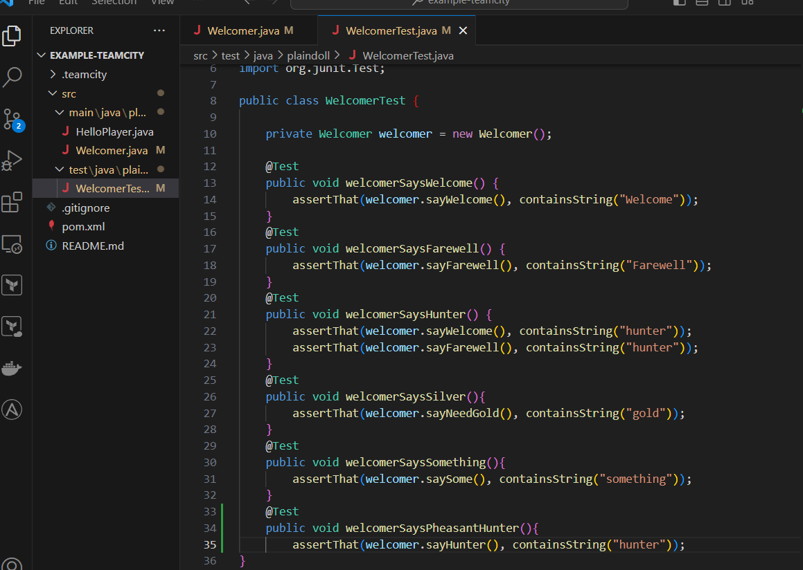

12. Сделал push всех изменений в новую ветку репозитория:

13. Сборка запустилась, тесты прошли успешно:

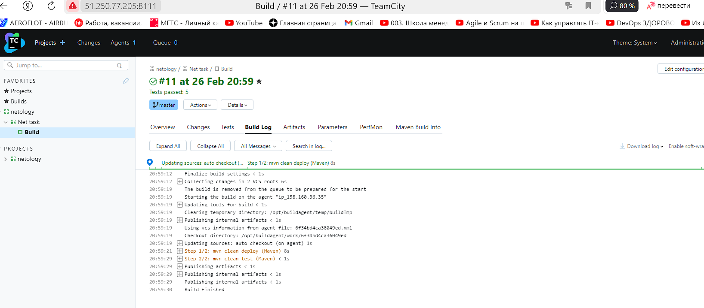

14. Внес изменения из произвольной ветки `feature/add_reply` в `master` через `Merge`.

15. Уже сужествовал собранный артефакт в сборке по ветке `master` в nexus, поэтому сборка была не успешной. Имеется несколько вариантов решеиня даннй проблемы:

* Изменить версию артефакта в `pom.xml`. - что я и сделал

* Настроить Nexus на принятия релизных артефактов для данного репозиторя, то есть разрешить обновлять артефакты. 

* Использовать снапшоты вместо релизов.

16. Конфигурация уже настроена на сборку jar.

17. Сборка завершилась успешно, артефакты собраны и опубликованы:

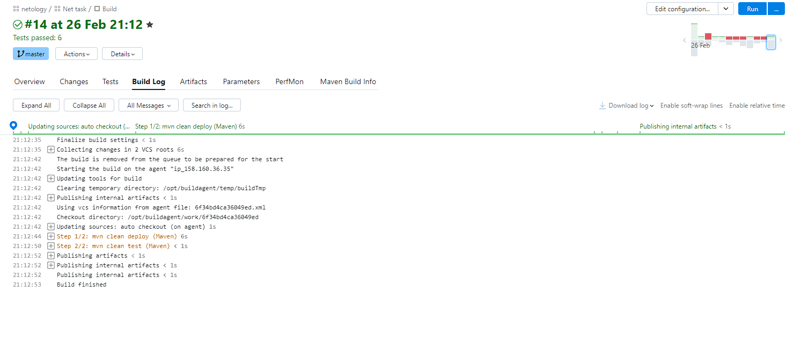

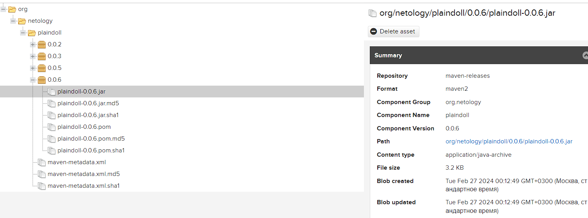

18. Проверил, что конфигурация в репозитории содержит все настройки конфигурации из teamcity:

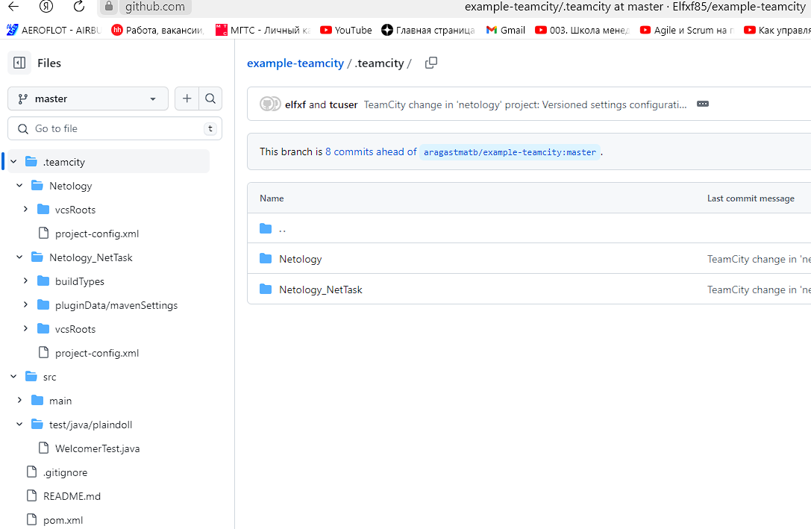

19. Ссылка на репозиторий: https://github.com/Elfxf85/example-teamcity