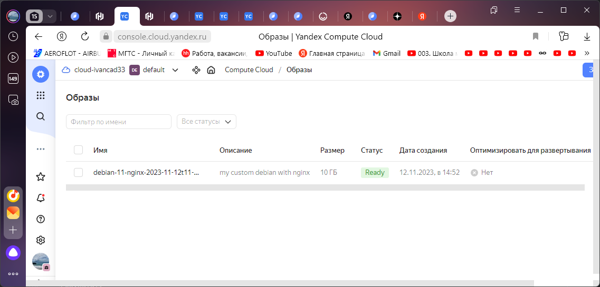

# Домашнее задание к занятию 4. «Оркестрация группой Docker-контейнеров на примере Docker Compose»

##Задача 1
Cоздайте собственный образ любой операционной системы (например, debian-11) с помощью Packer версии 1.7.0 . Перед выполнением задания изучите (инструкцию!!!). В инструкции указана минимальная версия 1.5, но нужно использовать 1.7, так как там есть нужный нам функционал
Чтобы получить зачёт, вам нужно предоставить скриншот страницы с созданным образом из личного кабинета YandexCloud.

Авторизуемся, создаем сеть, подсеть .
```console
root@server1:~# yc init
Welcome! This command will take you through the configuration process.
Please go to https://oauth.yandex.ru/authorize?response_type=token&client_id=1a6990aa636648e9b2ef855fa7bec2fb in order to obtain OAuth token.

Please enter OAuth token: y0_AgAAAAAIIsBGAATuwQAAAADxx0FFaMG86onpTYyRxd9128bowkuuqeY
You have one cloud available: 'cloud-ivancad33' (id = b1g8h2rh376qfol4bodf). It is going to be used by default.
Please choose folder to use:
 [1] default (id = b1gs07e2bjqttco10jqf)
 [2] Create a new folder
Please enter your numeric choice: 1
Your current folder has been set to 'default' (id = b1gs07e2bjqttco10jqf).
Do you want to configure a default Compute zone? [Y/n] y
Which zone do you want to use as a profile default?
 [1] ru-central1-a
 [2] ru-central1-b
 [3] ru-central1-c
 [4] ru-central1-d
 [5] Don't set default zone
Please enter your numeric choice: 1
Your profile default Compute zone has been set to 'ru-central1-a'.
root@server1:~#
root@server1:~# yc config list
token: y0_AgAAAAAIIsBGAATuwQAAAADxx0FFaMG86onpTYyRxd9128bowkuuqeY
cloud-id: b1g8h2rh376qfol4bodf
folder-id: b1gs07e2bjqttco10jqf
compute-default-zone: ru-central1-a
root@server1:~# yc vpc network create --name test-net --labels my-label=netology --description "test network via yc"
id: enpdrdt3pu23r64oh35i
folder_id: b1gs07e2bjqttco10jqf
created_at: "2023-11-12T11:27:12Z"
name: test-net
description: test network via yc
labels:
  my-label: netology
default_security_group_id: enpqu9hcvpqd0st260b3

root@server1:~# yc vpc subnet create --name test-subnet-a --zone ru-central1-a --range 10.1.2.0/24 --network-name test-net --description "test subnet via yc"
id: e9bkc01a7828r8se8lsi
folder_id: b1gs07e2bjqttco10jqf
created_at: "2023-11-12T11:27:43Z"
name: test-subnet-a
description: test subnet via yc
network_id: enpdrdt3pu23r64oh35i
zone_id: ru-central1-a
v4_cidr_blocks:
  - 10.1.2.0/24

root@server1:~# yc vpc network list
+----------------------+----------+
|          ID          |   NAME   |
+----------------------+----------+
| enp70hv581ggarjc12nq | default  |
| enpdrdt3pu23r64oh35i | test-net |
+----------------------+----------+
root@server1:~#
```
#установка packer 
```console

root@server1:/opt/yc# packer init /opt/yc/config.pkr.hcl
Installed plugin github.com/hashicorp/yandex v1.1.2 in "/root/.config/packer/plugins/github.com/hashicorp/yandex/packer-plugin-yandex_v1.1.2_x5.0_linux_amd64"
```
# Создание json для сборки образа
```console
root@server1:/opt/yc# cat imagedeb11.json
{
  "builders": [
    {
      "type":      "yandex",
      "token":     "y0_AgAAAAAIIsBGAATuwQAAAADxx0FFaMG86onpTYyRxd9128bowkuuqeY",
      "folder_id": "b1gs07e2bjqttco10jqf",
      "zone":      "ru-central1-a",

      "image_name":        "debian-11-nginx-{{isotime | clean_resource_name}}",
      "image_family":      "debian-web-server",
      "image_description": "my custom debian with nginx",

      "source_image_family": "debian-11",
      "subnet_id":           "e9bkc01a7828r8se8lsi",
      "use_ipv4_nat":        true,
      "disk_type":           "network-ssd",
      "ssh_username":        "debian"
    }
  ],
  "provisioners": [
    {
      "type": "shell",
      "inline": [
        "echo 'updating APT'",
        "sudo apt-get update -y",
        "sudo apt-get install -y nginx",
        "sudo su -",
        "sudo systemctl enable nginx.service",
        "curl localhost"
      ]
    }
  ]
}
```
#Сборка образа
```console

root@server1:/opt/yc# packer validate imagedeb11.json
The configuration is valid.
root@server1:/opt/yc# packer build imagedeb11.json
yandex: output will be in this color.
......
....
Build 'yandex' finished after 3 minutes 27 seconds.

==> Wait completed after 3 minutes 27 seconds

==> Builds finished. The artifacts of successful builds are:
--> yandex: A disk image was created: debian-11-nginx-2023-11-12t11-50-12z (id: fd8r4rp5imt2j9aot693) with family name debian-web-server
```


Результат:




Список образов (чтобы узнать id образа): `yc compute image list`
```console
root@server1:/opt/yc# yc compute image list
+----------------------+--------------------------------------+-------------------+----------------------+--------+
|          ID          |                 NAME                 |      FAMILY       |     PRODUCT IDS      | STATUS |
+----------------------+--------------------------------------+-------------------+----------------------+--------+
| fd8r4rp5imt2j9aot693 | debian-11-nginx-2023-11-12t11-50-12z | debian-web-server | f2edn2qkmo97e9idkiqr | READY  |
```

Удаление образа: `yc compute image delete --id fd8r4rp5imt2j9aot693`

Удаление подсети: `yc vpc subnet delete --name test-subnet-a`

Удаление сети: `yc vpc network delete --name test-net`


###Задача 2
2.1. Создайте вашу первую виртуальную машину в YandexCloud с помощью web-интерфейса YandexCloud.


### Решение.

```console 
server was created and started 
...

elfxf@server1:/opt/yc$ ssh elfxf@158.160.21.249
Welcome to Ubuntu 22.04.3 LTS (GNU/Linux 5.15.0-88-generic x86_64)

 * Documentation:  https://help.ubuntu.com
 * Management:     https://landscape.canonical.com
 * Support:        https://ubuntu.com/advantage

  System information as of Sun Nov 12 12:23:34 PM UTC 2023

  System load:  0.783203125        Processes:             140
  Usage of /:   28.0% of 14.68GB   Users logged in:       0
  Memory usage: 11%                IPv4 address for eth0: 10.129.0.9
  Swap usage:   0%


Expanded Security Maintenance for Applications is not enabled.

0 updates can be applied immediately.

Enable ESM Apps to receive additional future security updates.
See https://ubuntu.com/esm or run: sudo pro status


Last login: Sun Nov 12 12:23:35 2023 from 62.217.189.172
```
Скриншот


###Задача 3

С помощью Ansible и Docker Compose разверните на виртуальной машине из предыдущего задания систему мониторинга на основе Prometheus/Grafana. Используйте Ansible-код в директории (src/ansible).
Чтобы получить зачёт, вам нужно предоставить вывод команды "docker ps" , все контейнеры, описанные в docker-compose, должны быть в статусе "Up".

Запуск модифицированного конфига с Nginx вместо Caddy
```console 


elfxf@ubuntusrv1:~/install/virt-homeworks/05-virt-04-docker-compose/src/ansible/stack$ docker-compose up
[+] Running 7/7
 ✔ nginx 6 layers [⣿⣿⣿⣿⣿⣿]      0B/0B      Pulled                                                                                                                                                           5.9s
   ✔ bd159e379b3b Pull complete                                                                                                                                                                             1.0s
   ✔ 8d634ce99fb9 Pull complete                                                                                                                                                                             0.8s
   ✔ 98b0bbcc0ec6 Pull complete                                                                                                                                                                             0.5s
   ✔ 6ab6a6301bde Pull complete                                                                                                                                                                             1.0s
   ✔ f5d8edcd47b1 Pull complete                                                                                                                                                                             1.3s
   ✔ fe24ce36f968 Pull complete                                                                                                                                                                             1.5s
[+] Building 0.0s (0/0)                                                                                                                                                                           docker:default
[+] Running 7/7
 ✔ Container alertmanager  Created                                                                                                                                                                          1.8s
 ✔ Container nodeexporter  Created                                                                                                                                                                          1.8s
 ✔ Container cadvisor      Created                                                                                                                                                                          1.8s
 ✔ Container grafana       Created                                                                                                                                                                          1.8s
 ✔ Container pushgateway   Created                                                                                                                                                                          1.8s
 ✔ Container nginx-prom    Created                                                                                                                                                                          1.8s
 ✔ Container prometheus    Created                                                                                                                                                                          1.8s
 ......
 ..
 
elfxf@ubuntusrv1:~/install/virt-homeworks/05-virt-04-docker-compose/src/ansible/stack$ docker ps -a
CONTAINER ID   IMAGE                        COMMAND                  CREATED              STATUS                        PORTS
  NAMES
81b94941b2f2   prom/alertmanager:v0.20.0    "/bin/alertmanager -…"   About a minute ago   Up About a minute             9093/tcp
  alertmanager
69a7ae72ad29   nginx:1.23.1                 "/docker-entrypoint.…"   About a minute ago   Up About a minute             0.0.0.0:3000->3000/tcp, 0.0.0.0:9090-9091->9090-9091/tcp, 80/tcp, 0.0.0.0:9093->9093/tcp   nginx-prom
37628141166f   prom/prometheus:v2.17.1      "/bin/prometheus --c…"   About a minute ago   Up About a minute             9090/tcp
  prometheus
c01ad7404007   grafana/grafana:9.2.2        "/run.sh"                About a minute ago   Up About a minute             3000/tcp
  grafana
73657711331b   gcr.io/cadvisor/cadvisor     "/usr/bin/cadvisor -…"   About a minute ago   Up About a minute (healthy)   8080/tcp
  cadvisor
37b08287686b   prom/node-exporter:v0.18.1   "/bin/node_exporter …"   About a minute ago   Up About a minute             9100/tcp
  nodeexporter
385be724ff03   prom/pushgateway:v1.2.0      "/bin/pushgateway"       About a minute ago   Up About a minute             9091/tcp
  pushgateway

```

Скриншот


###Задача 4
Откройте веб-браузер, зайдите на страницу http://<внешний_ip_адрес_вашей_ВМ>:3000.
Используйте для авторизации логин и пароль из .env-file.
Изучите доступный интерфейс, найдите в интерфейсе автоматически созданные docker-compose-панели с графиками(dashboards).
Подождите 5-10 минут, чтобы система мониторинга успела накопить данные.
Чтобы получить зачёт, предоставьте:

скриншот работающего веб-интерфейса Grafana с текущими метриками:


Скриншот
