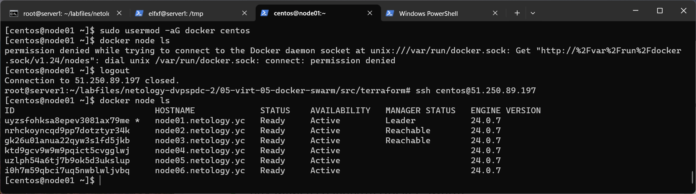
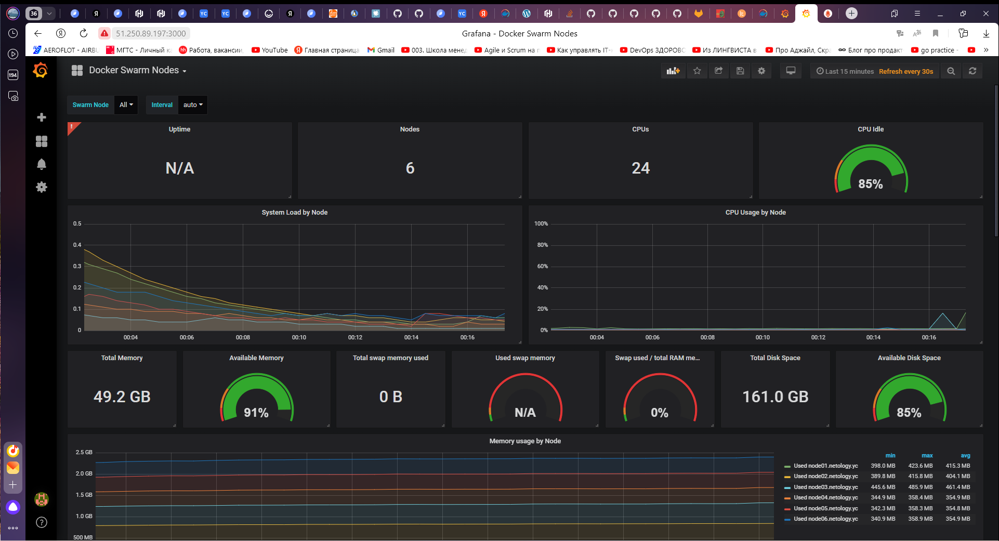
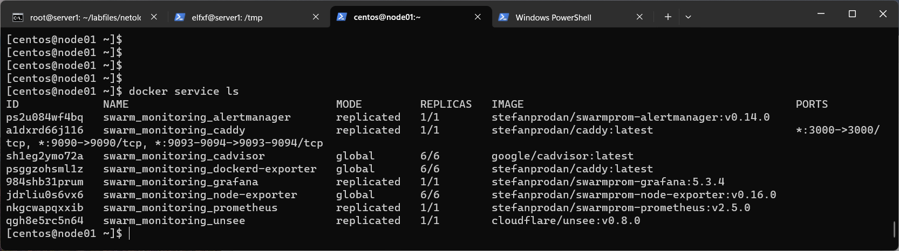
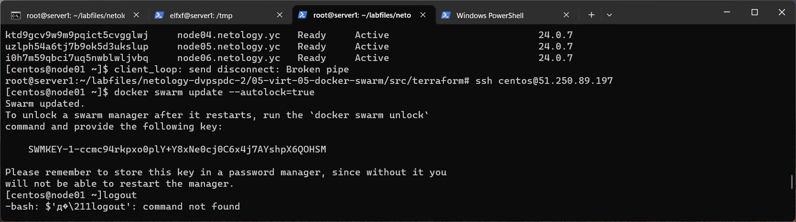

#Домашнее задание к занятию 5. «Оркестрация кластером Docker контейнеров на примере Docker Swarm»

##Задача 1
Дайте письменые ответы на вопросы:

В чём отличие режимов работы сервисов в Docker Swarm-кластере: replication и global?
Какой алгоритм выбора лидера используется в Docker Swarm-кластере?
Что такое Overlay Network?

```console
- Режимы работы сервисов в Docker Swarm-кластере:
    1. Replication: сервис запускается на определенном количестве узлов в кластере.
	Можно указать количество реплик (инстансов) сервиса для запуска на узлах. 
	Если один из узлов выходит из строя, Swarm запускает реплики сервиса на других доступных узлах.
	Этот режим работает хорошо для классических микросервисных приложений, где требуется масштабирование сервисов.
	
    2. Global: сервис запускается на каждом доступном узле в кластере. Количество реплик сервиса не указывается,
	их количество всегда равно количеству доступных узлов. Если новый узел присоединяется к кластеру, 
	Swarm автоматически запускает реплику сервиса на этом узле.
	Этот режим подходит для сервисов, которые требуют наличия экземпляра на каждом узле кластера для обеспечения
	высокой доступности и отказоустойчивости например, для сервисов обработки очередей.
	
- Алгоритм выбора лидера в Docker Swarm-кластере называется RAFT. 
(http://thesecretlivesofdata.com/raft/) 
Он используется для достижения консенсуса между менеджерами кластера о состоянии сервисов и поддержке высокой доступности. RAFT гарантирует, что 
только один менеджер может быть выбран в качестве лидера, а другие менеджеры следуют его решениям.

- Overlay Network (сеть оверлея) - это виртуальная сеть, которая позволяет связывать контейнеры и сервисы в разных узлах Docker Swarm-кластера. Overlay Network позволяет 
контейнерам в разных узлах обмениваться данными, как будто они находятся в одной сети. Это обеспечивает гибкость и масштабируемость взаимодействия между контейнерами в кластере, 
а также изоляцию и безопасность контейнеров от внешней сети.

```

##Задача 2
Создайте ваш первый Docker Swarm-кластер в Яндекс Облаке.

Чтобы получить зачёт, предоставьте скриншот из терминала (консоли) с выводом команды:

docker node ls

Результат:

1. Создадим сеть и подсеть для того чтобы собрать образ.
```console
root@server1:~/ycaccount/src# yc vpc network create --name net --labels my-label=netology --description "network via yc"
id: enpgntifkhqnsgptj1md
folder_id: b1gs07e2bjqttco10jqf
created_at: "2023-11-14T18:46:11Z"
name: net
description: network via yc
labels:
  my-label: netology
default_security_group_id: enpav8s6cat36b5caphi
root@server1:~/ycaccount/src# yc vpc subnet create --name my-subnet-a --zone ru-central1-a --range 10.1.2.0/24 --network-name net --description "subnet via yc"
id: e9bj0ndtkm9vhf9mc6ml
folder_id: b1gs07e2bjqttco10jqf
created_at: "2023-11-14T18:50:32Z"
name: my-subnet-a
description: subnet via yc
network_id: enpgntifkhqnsgptj1md
zone_id: ru-central1-a
v4_cidr_blocks:
  - 10.1.2.0/24
root@server1:~/ycaccount/src#

```
2.Настроим centos-7-base.json и запустим Packer:
packer build centos-7-base.json

3. Удаляем сеть и сабнет, нужны были для сборки.
root@server1:~/ycaccount/src/packer# yc vpc subnet delete --name my-subnet-a && yc vpc network delete --name net

4. Скорректируем конфигурационные файлы. variables.tf
 Инициализируем Terraform terraform init, проверим план terraform plan и применим его:
 
 ```console
 root@server1:~/labfiles# terraform validate
Success! The configuration is valid.
 root@server1:~/labfiles# terraform plan
Terraform used the selected providers to generate the following execution plan. Resource actions are indicated with the following symbols:
  + create
Terraform will perform the following actions:
.......

null_resource.monitoring (local-exec): PLAY RECAP *********************************************************************
null_resource.monitoring (local-exec): node01.netology.yc         : ok=3    changed=1    unreachable=0    failed=0    skipped=0    rescued=0    ignored=0
null_resource.monitoring (local-exec): node02.netology.yc         : ok=2    changed=0    unreachable=0    failed=0    skipped=1    rescued=0    ignored=0
null_resource.monitoring (local-exec): node03.netology.yc         : ok=2    changed=0    unreachable=0    failed=0    skipped=1    rescued=0    ignored=0

null_resource.monitoring: Creation complete after 26s [id=7265584286616486146]

Apply complete! Resources: 13 added, 0 changed, 0 destroyed.

Outputs:

external_ip_address_node01 = "51.250.89.197"
external_ip_address_node02 = "158.160.63.146"
external_ip_address_node03 = "158.160.59.110"
external_ip_address_node04 = "51.250.6.211"
external_ip_address_node05 = "62.84.116.52"
external_ip_address_node06 = "158.160.37.58"
internal_ip_address_node01 = "192.168.101.11"
internal_ip_address_node02 = "192.168.101.12"
internal_ip_address_node03 = "192.168.101.13"
internal_ip_address_node04 = "192.168.101.14"
internal_ip_address_node05 = "192.168.101.15"
internal_ip_address_node06 = "192.168.101.16"
root@server1:~/labfiles#
root@server1:~/labfiles# ssh centos@51.250.89.197

## add user into docker group
[centos@node01 ~]$ sudo usermod -aG docker centos
[[centos@node01 ~]$ logout
Connection to 51.250.89.197 closed.
root@server1:~/labfiles# ssh centos@51.250.89.197
[centos@node01 ~]$ docker node ls
ID                            HOSTNAME             STATUS    AVAILABILITY   MANAGER STATUS   ENGINE VERSION
uyzsfohksa8epev3081ax79me *   node01.netology.yc   Ready     Active         Leader           24.0.7
nrhckoyncqd9pp7dotztyr34k     node02.netology.yc   Ready     Active         Reachable        24.0.7
gk26u01anua22qyw3s1fd5jkb     node03.netology.yc   Ready     Active         Reachable        24.0.7
ktd9gcv9w9m9pqict5cvgglwj     node04.netology.yc   Ready     Active                          24.0.7
uzlph54a6tj7b9ok5d3ukslup     node05.netology.yc   Ready     Active                          24.0.7
i0h7m59qbci7uq5nwblwljvbq     node06.netology.yc   Ready     Active                          24.0.7
```




##Задача 3
Создайте ваш первый, готовый к боевой эксплуатации кластер мониторинга, состоящий из стека микросервисов.

Чтобы получить зачёт, предоставьте скриншот из терминала (консоли), с выводом команды:

docker service ls

 ```console
[centos@node01 ~]$ docker service ls
ID             NAME                                MODE         REPLICAS   IMAGE                                          PORTS
ps2u084wf4bq   swarm_monitoring_alertmanager       replicated   1/1        stefanprodan/swarmprom-alertmanager:v0.14.0
a1dxrd66j116   swarm_monitoring_caddy              replicated   1/1        stefanprodan/caddy:latest                      *:3000->3000/tcp, *:9090->9090/tcp, *:9093-9094->9093-9094/tcp
sh1eg2ymo72a   swarm_monitoring_cadvisor           global       6/6        google/cadvisor:latest
psggzohsml1z   swarm_monitoring_dockerd-exporter   global       6/6        stefanprodan/caddy:latest
984shb31prum   swarm_monitoring_grafana            replicated   1/1        stefanprodan/swarmprom-grafana:5.3.4
jdrliu0s6vx6   swarm_monitoring_node-exporter      global       6/6        stefanprodan/swarmprom-node-exporter:v0.16.0
nkgcwapqxxib   swarm_monitoring_prometheus         replicated   1/1        stefanprodan/swarmprom-prometheus:v2.5.0
qgh8e5rc5n64   swarm_monitoring_unsee              replicated   1/1        cloudflare/unsee:v0.8.0
```
смог запустить Http server Caddy, путем доработок в docker-compose.yml. В прошлый раз заменил Caddy на Nginx.




##Задача 4 (*)
Выполните на лидере Docker Swarm-кластера команду, указанную ниже, и дайте письменное описание её функционала — что она делает и зачем нужна:
# см.документацию: https://docs.docker.com/engine/swarm/swarm_manager_locking/
docker swarm update --autolock=true

 ```console
[centos@node01 ~]$ docker swarm update --autolock=true
Swarm updated.
To unlock a swarm manager after it restarts, run the `docker swarm unlock`
command and provide the following key:

    SWMKEY-1-ccmc94rkpxo0plY+Y8xNe0cj0C6x4j7AYshpX6QOHSM

Please remember to store this key in a password manager, since without it you
will not be able to restart the manager.
[centos@node01 ~]$
```

Команда `docker swarm update --autolock=true` создаёт ключ для шифрования/дешифрования логов Raft.
Docker по умолчанию шифрует сообщения между нодами и Raft логи на нодах-манеджерах.
Но сами секретные ключи не защищены.
Активация функции [autolock](https://docs.docker.com/engine/swarm/swarm_manager_locking) позволяет защифровать эти самые ключи.
В момент активации функции будет сгенерирован специальный токен с которым будут зашифрованы используемые ключи.
После, при каждой перезагрузке **Docker** демона потребуется разблокировка кластера (расшифровка ключей) командой `docker swarm unlock`.