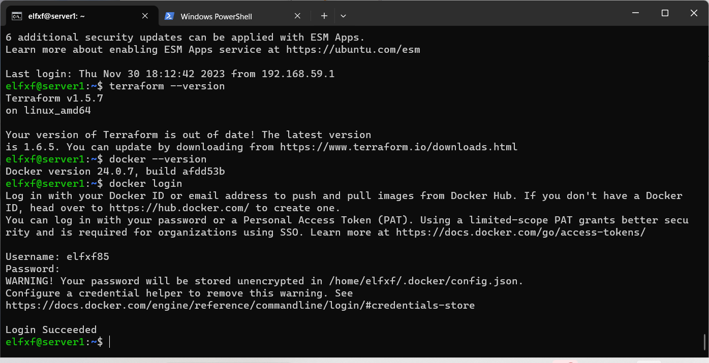
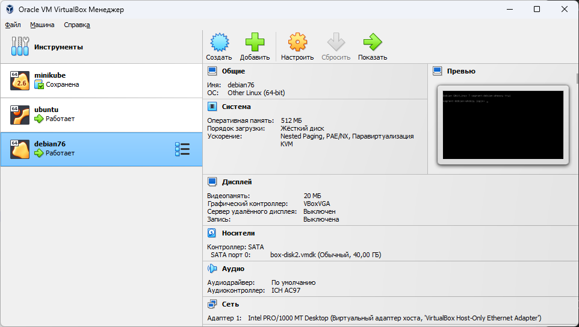

##Домашнее задание к занятию «Введение в Terraform»

##Чек-лист готовности к домашнему заданиюЧеклист
Скачайте и установите Terraform версии =1.5.Х (версия 1.6 может вызывать проблемы с Яндекс провайдером) . Приложите скриншот вывода команды terraform --version.
Скачайте на свой ПК этот git-репозиторий. Исходный код для выполнения задания расположен в директории 01/src.
Убедитесь, что в вашей ОС установлен docker.
Зарегистрируйте аккаунт на сайте https://hub.docker.com/, выполните команду docker login и введите логин, пароль.
##Решение:
1. Cкачайте и установите Terraform версии =1.5.Х : task1 скриншот ниже
2.Скачайте на свой ПК этот git-репозиторий.
```console
PS C:\Users\ivanc\OneDrive\Документы\repos\teraform> git clone https://github.com/netology-code/ter-homeworks
Cloning into 'ter-homeworks'...
remote: Enumerating objects: 994, done.
remote: Counting objects: 100% (268/268), done.
remote: Compressing objects: 100% (93/93), done.
Receiving objects: 100% (994/994), 216.80 KiB | 1.45 MiB/s, done.
```
3. Убедитесь, что в вашей ОС установлен docker. : task1 скриншот ниже
4. выполните команду docker login : task1 скриншот ниже


##Задание 1

1. Done

2. Cекретную информацию в файле с именем  personal.auto.tfvars в папке проекта

3. Выполните код проекта. Найдите в state-файле секретное содержимое созданного ресурса random_password, пришлите в качестве ответа конкретный ключ и его значение.
 ```console
"type": "random_password",
"result": "RZsrr3D9etlHI0ll",
```

4. Раскомментируйте блок кода, примерно расположенный на строчках 29–42 файла main.tf. 
   Выполните команду terraform validate. Объясните, в чём заключаются намеренно допущенные ошибки. Исправьте их.
   
 Ответ: В коде  имя ресурса   docker_container начиналось с цифры а разрешено с подчеркивания ли буквы, а так же были опечатки в string interpolation 
Так же было пропущено имя ресурса -  resource "docker_image" "nginx"   так как "All resource blocks must have 2 labels (type, name)"

main.tf

 ```console
terraform {
  required_providers {
    docker = {
      source  = "kreuzwerker/docker"
      version = "~> 3.0.1"
    }
  }
  required_version = ">=0.13"

}
provider "docker" {}

resource "random_password" "random_string" {
  length      = 16
  special     = false
  min_upper   = 1
  min_lower   = 1
  min_numeric = 1
}

resource "docker_image" "nginx" {
  name         = "nginx:latest"
  keep_locally = true
}

resource "docker_container" "nginx" {
  image = docker_image.nginx.image_id
  name  = "example_${random_password.random_string.result}"
  ports {
    internal = 80
    external = 8008
  }
}
```

Вывод консоли

 ```console
root@server1:/opt/repos/ter-homeworks/01/src# terraform apply
random_password.random_string: Refreshing state... [id=none]
docker_image.nginx: Refreshing state... [id=sha256:a6bd71f48f6839d9faae1f29d3babef831e76bc213107682c5cc80f0cbb30866nginx:latest]
docker_container.nginx: Refreshing state... [id=036b3c72fb8386150d28921eab0c44f2564320c9be11dd329aebf41c140c9b29]

Terraform used the selected providers to generate the following execution plan. Resource actions are indicated with the following symbols:
  + create

Terraform will perform the following actions:

  # docker_container.nginx will be created
  + resource "docker_container" "nginx" {
      + attach                                      = false
      + bridge                                      = (known after apply)
      + command                                     = (known after apply)
      + container_logs                              = (known after apply)
      + container_read_refresh_timeout_milliseconds = 15000
      + entrypoint                                  = (known after apply)
      + env                                         = (known after apply)
      + exit_code                                   = (known after apply)
      + hostname                                    = (known after apply)
      + id                                          = (known after apply)
      + image                                       = "sha256:a6bd71f48f6839d9faae1f29d3babef831e76bc213107682c5cc80f0cbb30866"
      + init                                        = (known after apply)
      + ipc_mode                                    = (known after apply)
      + log_driver                                  = (known after apply)
      + logs                                        = false
      + must_run                                    = true
      + name                                        = (sensitive value)
      + network_data                                = (known after apply)
      + read_only                                   = false
      + remove_volumes                              = true
      + restart                                     = "no"
      + rm                                          = false
      + runtime                                     = (known after apply)
      + security_opts                               = (known after apply)
      + shm_size                                    = (known after apply)
      + start                                       = true
      + stdin_open                                  = false
      + stop_signal                                 = (known after apply)
      + stop_timeout                                = (known after apply)
      + tty                                         = false
      + wait                                        = false
      + wait_timeout                                = 60

      + ports {
          + external = 8008
          + internal = 80
          + ip       = "0.0.0.0"
          + protocol = "tcp"
        }
    }

Plan: 1 to add, 0 to change, 0 to destroy.

Do you want to perform these actions?
  Terraform will perform the actions described above.
  Only 'yes' will be accepted to approve.

  Enter a value: yes

docker_container.nginx: Creating...
docker_container.nginx: Creation complete after 1s [id=3b726f4059497d13bc92f75f810cd1a871b41dd132ac6f0a4a1a592d91a7e9d2]

Apply complete! Resources: 1 added, 0 changed, 0 destroyed.
root@server1:/opt/repos/ter-homeworks/01/src# docker ps
CONTAINER ID   IMAGE                           COMMAND                  CREATED         STATUS             PORTS
                                                NAMES
3b726f405949   a6bd71f48f68                    "/docker-entrypoint.…"   6 seconds ago   Up 6 seconds       0.0.0.0:8008->80/tcp
                                                example_RZsrr3D9etlHI0ll


```
6. Пункт

Опасность применения ключа -auto-approve заключается в том, что вы не будете иметь возможности внимательно проверить изменения перед их применением. 
В целом, ключ -auto-approve в terraform apply может быть опасен, так как он позволяет применять изменения в инфраструктуре без подтверждения и контроля оператора,
что может привести к нежелательным последствиям и потере контроля над процессом изменения инфраструктуры.

Зачем может пригодиться данный ключ?
a. Автоматизированные процессы CI/CD: Когда вы используете инструменты CI/CD для автоматического развертывания приложений или инфраструктуры,
ключ -auto-approve позволяет избежать блокировки на запросе подтверждения операции Terraform. Это удобно, когда нет возможности взаимодействия с
пользователем во время автоматического развертывания.
b. Пакетные операции и скрипты: Если вы хотите включить выполнение операции Terraform в пакетный файл или скрипт, ключ -auto-approve может использоваться для 
обеспечения автоматического подтверждения операции.

```console

Apply complete! Resources: 3 added, 0 changed, 0 destroyed.
root@server1:/opt/repos/ter-homeworks/01/src# docker ps
CONTAINER ID   IMAGE                           COMMAND                  CREATED         STATUS             PORTS
                                                NAMES
f9d76ce1d518   a6bd71f48f68                    "/docker-entrypoint.…"   8 seconds ago   Up 7 seconds       0.0.0.0:8008->80/tcp
                                                hello_world
```


7. Уничтожьте созданные ресурсы с помощью terraform. Убедитесь, что все ресурсы удалены. Приложите содержимое файла terraform.tfstate.
terraform destroy 

```console
{
  "version": 4,
  "terraform_version": "1.5.7",
  "serial": 18,
  "lineage": "3bbeb657-c53a-33fb-4ec8-bceeab411c38",
  "outputs": {},
  "resources": [],
  "check_results": null
}
```


8. Объясните, почему при этом не был удалён docker-образ nginx:latest.
 Ответ: из за keep_locally =true
```console
force_remove (Boolean) If true, then the image is removed forcibly when the resource is destroyed.
keep_locally (Boolean) If true, then the Docker image won't be deleted on destroy operation. If this is false, it will delete the image from the docker local storage on destroy operation.

```


##Задание 2

Выбран обар с Github для  VirtualBox
https://github.com/kraksoft/vagrant-box-debian/releases/download/7.6.0/debian-7.6.0-amd64.box

```console
PS C:\Users\ivanc\OneDrive\Документы\repos\task1_2> terraform plan

Terraform used the selected providers to generate the following execution plan. Resource actions are indicated with the following symbols:
  + create

Terraform will perform the following actions:

  # virtualbox_vm.vm1 will be created
  + resource "virtualbox_vm" "vm1" {
      + cpus   = 1
      + id     = (known after apply)
      + image  = "https://github.com/kraksoft/vagrant-box-debian/releases/download/7.6.0/debian-7.6.0-amd64.box"
      + memory = "512 mib"
      + name   = "debian76"
      + status = "running"

      + network_adapter {
          + device                 = "IntelPro1000MTDesktop"
          + host_interface         = "VirtualBox Host-Only Ethernet Adapter"
          + ipv4_address           = (known after apply)
          + ipv4_address_available = (known after apply)
          + mac_address            = (known after apply)
          + status                 = (known after apply)
          + type                   = "hostonly"
        }
    }

Plan: 1 to add, 0 to change, 0 to destroy.

Changes to Outputs:
  + IPAddress = (known after apply)

```

