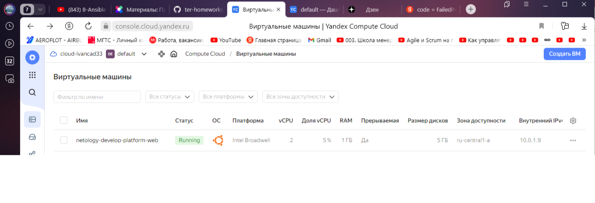
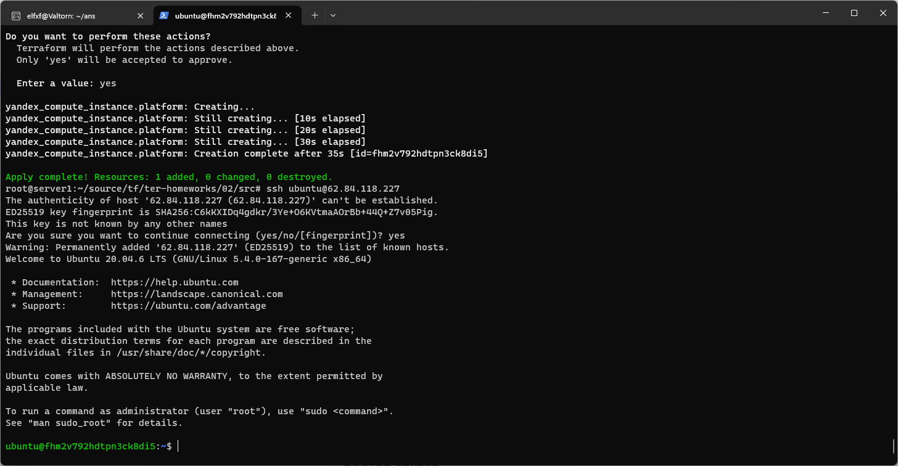
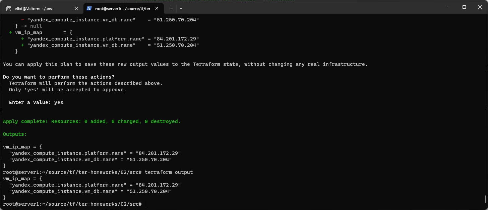

##Домашнее задание к занятию «Основы Terraform. Yandex Cloud»

##Чек-лист готовности к домашнему заданию
Зарегистрирован аккаунт в Yandex Cloud. Использован промокод на грант.
Установлен инструмент Yandex CLI.
Исходный код для выполнения задания расположен в директории 02/src.

https://console.cloud.yandex.ru/folders/dn2pkmo52snsv7oi8ukf/vpc/security-groups

##Задание 1


4. Инициализируйте проект, выполните код. Исправьте намеренно допущенные синтаксические ошибки. Ищите внимательно, посимвольно. Ответьте, в чём заключается их суть.

Ошибки были: опечатки, platform v4 не найдена - использовал v1.  

```console
root@server1:~/source/tf/ter-homeworks/02/src# terraform apply
data.yandex_compute_image.ubuntu: Reading...
yandex_vpc_network.develop: Refreshing state... [id=enphg02k5k9tcv0hedh5]
data.yandex_compute_image.ubuntu: Read complete after 1s [id=fd8b6qcrqbaqtnuumbph]
yandex_vpc_subnet.develop: Refreshing state... [id=e9bcri65ne526d3ck6au]
yandex_compute_instance.vm_db: Refreshing state... [id=fhmvddsrdntdamiv8age]

Terraform used the selected providers to generate the following execution plan. Resource actions are indicated with the following symbols:
  + create
  ....
  ...
  ..
Plan: 1 to add, 0 to change, 0 to destroy.

Do you want to perform these actions?
  Terraform will perform the actions described above.
  Only 'yes' will be accepted to approve.

  Enter a value: yes

yandex_compute_instance.platform: Creating...
yandex_compute_instance.platform: Still creating... [10s elapsed]
yandex_compute_instance.platform: Still creating... [20s elapsed]
yandex_compute_instance.platform: Still creating... [30s elapsed]
yandex_compute_instance.platform: Creation complete after 35s [id=fhm2v792hdtpn3ck8di5]

Apply complete! Resources: 1 added, 0 changed, 0 destroyed.
root@server1:~/source/tf/ter-homeworks/02/src#

```


 5. Ответьте, как в процессе обучения могут пригодиться параметры preemptible = true и core_fraction=5 в параметрах ВМ. Ответ в документации Yandex Cloud.

В процессе обучения параметры preemptible = true и core_fraction=5 могут быть полезными:
a. preemptible = true: Позволяет создать вычислительные ресурсы с предварительным уведомлением о возможной остановке. Это может быть полезным в случаях, когда обучение модели не требует безопасного сохранения состояния и может быть перезапущено без потери результатов.
b. core_fraction=5: Определяет долю вычислительных ядер, которую можно использовать для одной виртуальной машины. Это может пригодиться в ситуациях, когда обучение модели не требует полного использования всех доступных ядер и можно распределить вычислительные ресурсы между несколькими экземплярами виртуальных машин.

------------------------------
В качестве решения приложите:
скриншот ЛК Yandex Cloud с созданной ВМ;


скриншот успешного подключения к консоли ВМ через ssh. К OS ubuntu "out of a box, те из коробки" необходимо подключаться под пользователем ubuntu: "ssh ubuntu@vm_ip_address"; Вы познакомитесь с тем как при создании ВМ кастомизировать пользователя в блоке metadata в следующей лекции.



###Задание 4
Объявите в файле outputs.tf output типа map, содержащий { instance_name = external_ip } для каждой из ВМ.
Примените изменения.
В качестве решения приложите вывод значений ip-адресов команды terraform output.
```console
root@server1:~/source/tf/ter-homeworks/02/src# terraform output
vm_ip_map = {
  "yandex_compute_instance.platform.name" = "84.201.172.29"
  "yandex_compute_instance.vm_db.name" = "51.250.70.204"
}
```



###Задание 7

Изучите содержимое файла console.tf. Откройте terraform console, выполните следующие задания:

Напишите, какой командой можно отобразить второй элемент списка test_list.
```console
> local.test_list[1]
"staging"
>
```
Найдите длину списка test_list с помощью функции length(<имя переменной>).
```console
> length(local.test_list)
3
>
```

Напишите, какой командой можно отобразить значение ключа admin из map test_map.
```console

> keys(local.test_map)[0]
"admin"
> values(local.test_map)[0]
"John"

-----------------------
or
> local.test_map.admin
"John"

```
Напишите interpolation-выражение, результатом которого будет: "John is admin for production server based on OS ubuntu-20-04 with X vcpu, Y ram and Z virtual disks", используйте данные из переменных test_list, test_map, servers и функцию length() для подстановки значений.

Добавиол переменную с конкатенацией в locals.tf
```console
locals.tf
value = "${local.test_map.admin} is admin for ${local.test_list[length(local.test_list)-1]} server based on OS ${local.servers[local.test_list[length(local.test_list)-1]]["image"]} with ${local.servers[local.test_list[length(local.test_list)-1]]["cpu"]} vcpu,
 ${local.servers[local.test_list[length(local.test_list)-1]]["ram"]} ram, and ${length(local.servers.production["disks"]) } virtual disks"

---------

> local.value
"John is admin for production server based on OS ubuntu-20-04 with 10 vcpu, 40 ram, and 4 virtual disks"
>
```


