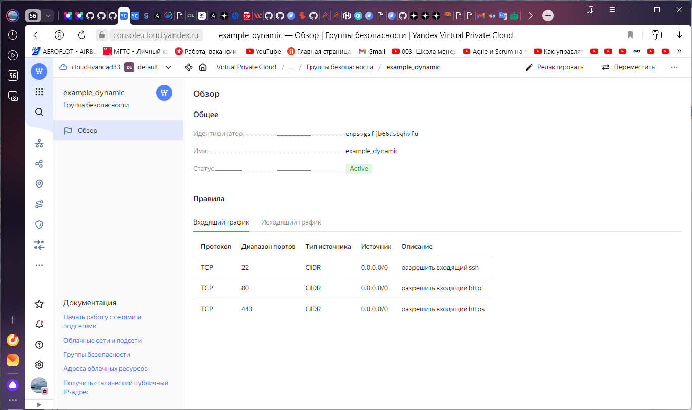
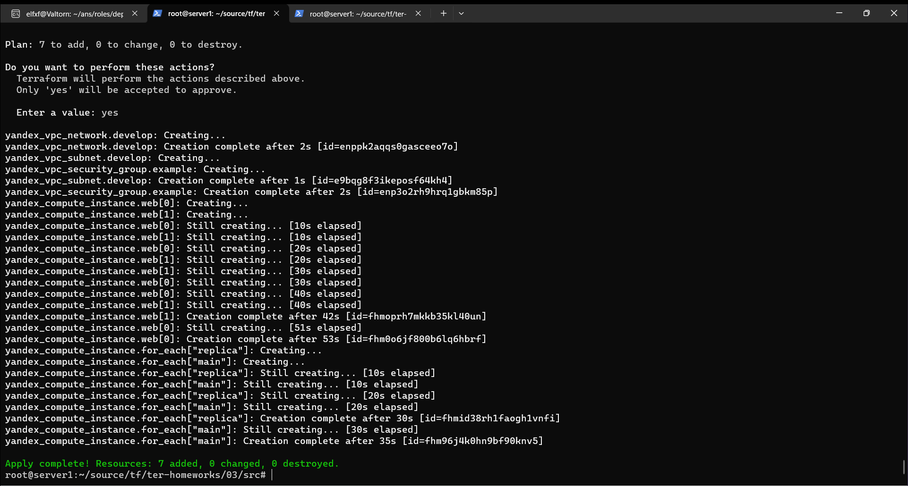
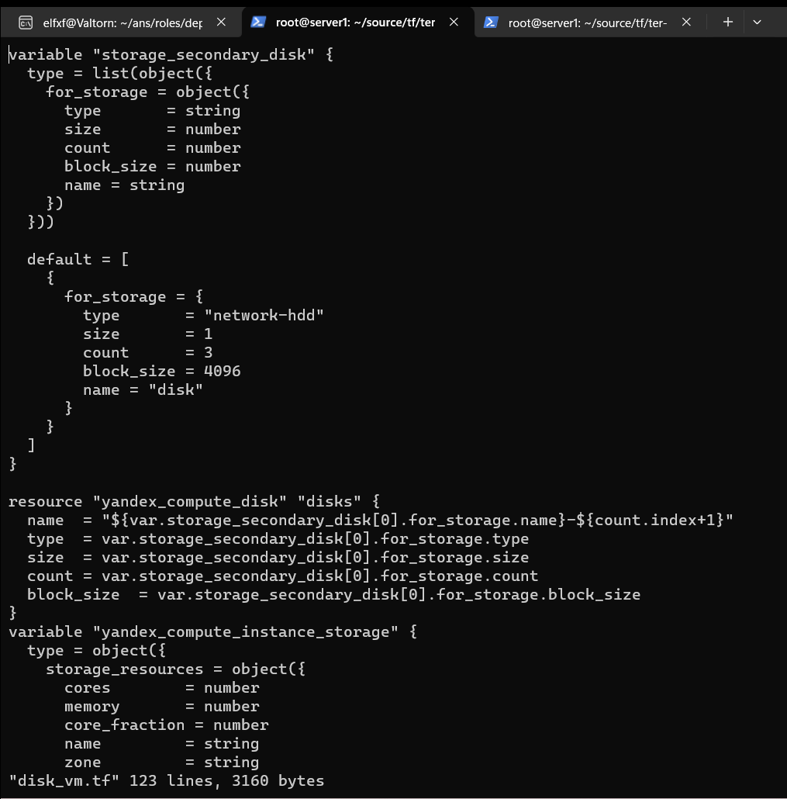
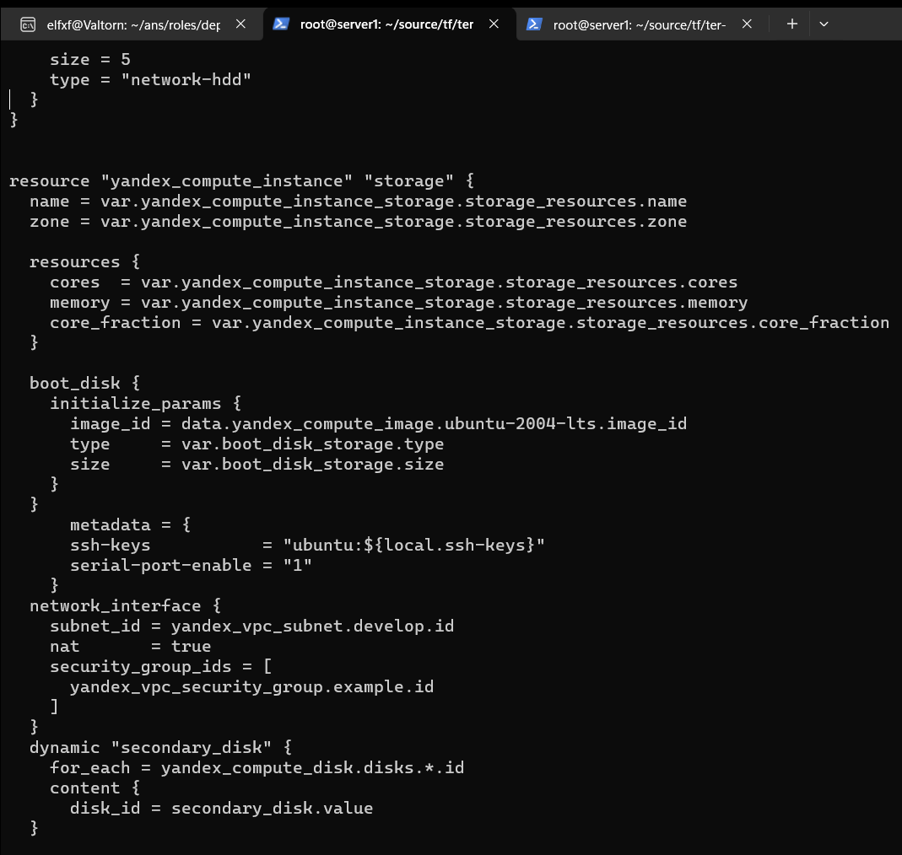

##Домашнее задание к занятию «Управляющие конструкции в коде Terraform»

исходный код для выполнения задания в директории 03/src.

##Задание 1

Изучите проект.
Заполните файл personal.auto.tfvars.
Инициализируйте проект, выполните код. Он выполнится, даже если доступа к preview нет.
-- yc iam create-token



------

### Задание 2

1. Создайте файл count-vm.tf. Опишите в нём создание двух **одинаковых** ВМ  web-1 и web-2 (не web-0 и web-1) с минимальными параметрами, используя мета-аргумент **count loop**. Назначьте ВМ созданную в первом задании группу безопасности.(как это сделать узнайте в документации провайдера yandex/compute_instance )
2. Создайте файл for_each-vm.tf. Опишите в нём создание двух ВМ с именами "main" и "replica" **разных** по cpu/ram/disk , используя мета-аргумент **for_each loop**. Используйте для обеих ВМ одну общую переменную типа list(object({ vm_name=string, cpu=number, ram=number, disk=number  })). При желании внесите в переменную все возможные параметры.
3. ВМ из пункта 2.2 должны создаваться после создания ВМ из пункта 2.1.
4. Используйте функцию file в local-переменной для считывания ключа ~/.ssh/id_rsa.pub и его последующего использования в блоке metadata, взятому из ДЗ 2.
5. Инициализируйте проект, выполните код.

### Решение 2
1. Создал файл count-vm.tf и описал в нем 2 одинаковые виртуальные машины, которые будут называться web-1 и web-2:
2. Создал файл for_each-vm.tf. В нем описал создание двух ВМ с именами "main" и "replica" разных по cpu/ram/disk , используя мета-аргумент for_each loop:
3. ВМ с именами "main" и "replica" создаются после создания ВМ web-1 и web-2:
4. Для считывания файла ключа использую local-переменную и использую ее в блоке metadata:
5. Инициализировал проект, выполнил код. Создалось 7 объектов - сеть, подсеть, группа безопасности и 4 виртуальные машины:


### Задание 3

1. Создайте 3 одинаковых виртуальных диска размером 1 Гб с помощью ресурса yandex_compute_disk и мета-аргумента count в файле **disk_vm.tf** .
2. Создайте в том же файле **одиночную**(использовать count или for_each запрещено из-за задания №4) ВМ c именем "storage"  . Используйте блок **dynamic secondary_disk{..}** и мета-аргумент for_each для подключения созданных вами дополнительных дисков.

### Решение 3

1. Создал 3 одинаковых диска:



2. Создал виртуальную машину storage и используя мета-аргумент for_each подключил к ней созданные диски:




### Задание 4

1. В файле ansible.tf создайте inventory-файл для ansible.
Используйте функцию tepmplatefile и файл-шаблон для создания ansible inventory-файла из лекции.
Готовый код возьмите из демонстрации к лекции [**demonstration2**](https://github.com/netology-code/ter-homeworks/tree/main/03/demonstration2).
Передайте в него в качестве переменных группы виртуальных машин из задания 2.1, 2.2 и 3.2, т. е. 5 ВМ.
2. Инвентарь должен содержать 3 группы [webservers], [databases], [storage] и быть динамическим, т. е. обработать как группу из 2-х ВМ, так и 999 ВМ.
3. Выполните код. Приложите скриншот получившегося файла. 

Для общего зачёта создайте в вашем GitHub-репозитории новую ветку terraform-03. Закоммитьте в эту ветку свой финальный код проекта, пришлите ссылку на коммит.   
**Удалите все созданные ресурсы**.

### Решение 4

1. В файле ansible.tf создал inventory-файл для ansible.
```console
resource "local_file" "hosts_cfg" {
  content = templatefile("${path.module}/hosts.tftpl",
   {webservers =  yandex_compute_instance.web
    databases = yandex_compute_instance.for_each
    storage = [yandex_compute_instance.storage]}
  )
  filename = "${abspath(path.module)}/hosts.cfg"
}
```

Шаблон инвентари файла использовал из лекции.

2. Инвентари файл вышел с 3 группами.
3. Переменная FQDN добавлена


 Результат в консоли:

```console
root@server1:~/source/tf/ter-homeworks/03/src# terraform apply
data.yandex_compute_image.ubuntu-2004-lts: Reading...
data.yandex_compute_image.ubuntu: Reading...
data.yandex_compute_image.ubuntu-2004-lts: Read complete after 1s [id=fd8fo5t7f6j6iqvjnk3b]
data.yandex_compute_image.ubuntu: Read complete after 1s [id=fd8fo5t7f6j6iqvjnk3b]
.............


[root@server1:~/source/tf/ter-homeworks/03/src# cat hosts.cfg
[webservers]

web-1   ansible_host=158.160.122.39 fqdn=fhm8k1oojmm5lie8i22a.auto.internal
web-2   ansible_host=158.160.33.72 fqdn=fhmg9j6deigu4nnsbks3.auto.internal
[databases]

main   ansible_host=158.160.55.49 fqdn=fhm0n11apj3a0rh5b68u.auto.internal
replica   ansible_host=158.160.41.72 fqdn=fhmh70jfbjhd1uruhe33.auto.internal
[storage]

storage   ansible_host=158.160.117.111 fqdn=fhm50qqln03btjpt2mss.auto.internal
```


### Задание 6* (необязательное)

1. Используя null_resource и local-exec, примените ansible-playbook к ВМ из ansible inventory-файла.
Готовый код возьмите из демонстрации к лекции [**demonstration2**](https://github.com/netology-code/ter-homeworks/tree/main/demonstration2).
2. Дополните файл шаблон hosts.tftpl. 
Формат готового файла:
```console 
netology-develop-platform-web-0   ansible_host="<внешний IP-address или внутренний IP-address если у ВМ отсутвует внешний адрес>"```

Для проверки работы уберите у ВМ внешние адреса. Этот вариант используется при работе через bastion-сервер.
Для зачёта предоставьте код вместе с основной частью задания.


### Решение 6

1. Создал null_resource по примеру из  ***demonstration2***.

Проверяю, результат работы Ansible, то есть установился ли Nginx по логам и дальее вывод --version

```console
yandex_compute_instance.storage: Creation complete after 30s [id=fhmeu3lm3s9f8obr7gqr]
null_resource.web_hosts_provision: Creating...
null_resource.web_hosts_provision: Provisioning with 'local-exec'...
null_resource.web_hosts_provision (local-exec): Executing: ["/bin/sh" "-c" "cat ~/.ssh/id_rsa | ssh-add -"]
null_resource.web_hosts_provision (local-exec): Identity added: (stdin) (root@server1)
null_resource.web_hosts_provision: Provisioning with 'local-exec'...
null_resource.web_hosts_provision (local-exec): Executing: ["/bin/sh" "-c" "sleep 100"]
yandex_compute_instance.web[0]: Still creating... [40s elapsed]
yandex_compute_instance.web[1]: Still creating... [40s elapsed]
yandex_compute_instance.web[1]: Creation complete after 41s [id=fhmcbbd03u2c9q3jfoa6]
yandex_compute_instance.web[0]: Creation complete after 41s [id=fhmm6rvec06k2d3svfbg]
yandex_compute_instance.for_each["main"]: Creating...
yandex_compute_instance.for_each["replica"]: Creating...
null_resource.web_hosts_provision: Still creating... [10s elapsed]
yandex_compute_instance.for_each["main"]: Still creating... [10s elapsed]
yandex_compute_instance.for_each["replica"]: Still creating... [10s elapsed]
null_resource.web_hosts_provision: Still creating... [20s elapsed]
yandex_compute_instance.for_each["replica"]: Still creating... [20s elapsed]
yandex_compute_instance.for_each["main"]: Still creating... [20s elapsed]
yandex_compute_instance.for_each["replica"]: Creation complete after 24s [id=fhmj4mqg87p2kus76vgi]
null_resource.web_hosts_provision: Still creating... [30s elapsed]
yandex_compute_instance.for_each["main"]: Still creating... [30s elapsed]
yandex_compute_instance.for_each["main"]: Creation complete after 36s [id=fhmme4r2il0pvb1c23vh]
local_file.hosts_cfg: Creating...
local_file.hosts_cfg: Creation complete after 0s [id=b9e70f217a56e40d549216ae2379a4073ded60ea]
null_resource.web_hosts_provision: Still creating... [40s elapsed]
null_resource.web_hosts_provision: Still creating... [50s elapsed]
null_resource.web_hosts_provision: Still creating... [1m0s elapsed]
null_resource.web_hosts_provision: Still creating... [1m10s elapsed]
null_resource.web_hosts_provision: Still creating... [1m20s elapsed]
null_resource.web_hosts_provision: Still creating... [1m30s elapsed]
null_resource.web_hosts_provision: Still creating... [1m40s elapsed]
null_resource.web_hosts_provision: Provisioning with 'local-exec'...
null_resource.web_hosts_provision (local-exec): Executing: ["/bin/sh" "-c" "export ANSIBLE_HOST_KEY_CHECKING=False; ansible-playbook -i /root/source/tf/ter-homeworks/03/src/hosts.cfg /root/source/tf/ter-homeworks/03/src/test.yml"]
null_resource.web_hosts_provision (local-exec): [WARNING]: Found both group and host with same name: storage

null_resource.web_hosts_provision (local-exec): PLAY [test] ********************************************************************

null_resource.web_hosts_provision (local-exec): TASK [Install Nginx Web Server on Debian Family] *******************************
null_resource.web_hosts_provision: Still creating... [1m50s elapsed]
null_resource.web_hosts_provision: Still creating... [2m0s elapsed]
null_resource.web_hosts_provision: Still creating... [2m10s elapsed]
null_resource.web_hosts_provision (local-exec): changed: [replica]
null_resource.web_hosts_provision (local-exec): changed: [main]
null_resource.web_hosts_provision: Still creating... [2m20s elapsed]
null_resource.web_hosts_provision (local-exec): changed: [storage]
null_resource.web_hosts_provision: Still creating... [2m30s elapsed]
null_resource.web_hosts_provision (local-exec): changed: [web-1]
null_resource.web_hosts_provision: Still creating... [2m40s elapsed]
null_resource.web_hosts_provision (local-exec): changed: [web-2]

null_resource.web_hosts_provision (local-exec): PLAY RECAP *********************************************************************
null_resource.web_hosts_provision (local-exec): main                       : ok=1    changed=1    unreachable=0    failed=0    skipped=0    rescued=0    ignored=0
null_resource.web_hosts_provision (local-exec): replica                    : ok=1    changed=1    unreachable=0    failed=0    skipped=0    rescued=0    ignored=0
null_resource.web_hosts_provision (local-exec): storage                    : ok=1    changed=1    unreachable=0    failed=0    skipped=0    rescued=0    ignored=0
null_resource.web_hosts_provision (local-exec): web-1                      : ok=1    changed=1    unreachable=0    failed=0    skipped=0    rescued=0    ignored=0
null_resource.web_hosts_provision (local-exec): web-2                      : ok=1    changed=1    unreachable=0    failed=0    skipped=0    rescued=0    ignored=0

null_resource.web_hosts_provision: Creation complete after 2m41s [id=9070761945291434220]

Apply complete! Resources: 13 added, 0 changed, 0 destroyed.

root@server1:~/source/tf/ter-homeworks/03/src# ssh ubuntu@158.160.122.39
Welcome to Ubuntu 20.04.6 LTS (GNU/Linux 5.4.0-167-generic x86_64)

 * Documentation:  https://help.ubuntu.com
 * Management:     https://landscape.canonical.com
 * Support:        https://ubuntu.com/advantage
New release '22.04.3 LTS' available.
Run 'do-release-upgrade' to upgrade to it.

Last login: Thu Dec 14 11:31:56 2023 from 62.217.185.118
ubuntu@fhm8k1oojmm5lie8i22a:~$ nginx -v
nginx version: nginx/1.18.0 (Ubuntu)

```

Nginx установлен.

2. Изменил hosts.tftpl 
```console
 ansible_host=${i["network_interface"][0]["nat_ip_address"]==null ? i["network_interface"][0]["ip_address"] : i["network_interface"][0]["nat_ip_address"]} 
 ```
проверяет, есть ли у хоста nat_ip_address. Если nat_ip_address равен null, то используется ip_address. В противном случае, если nat_ip_address 
не является null, то используется nat_ip_address.


