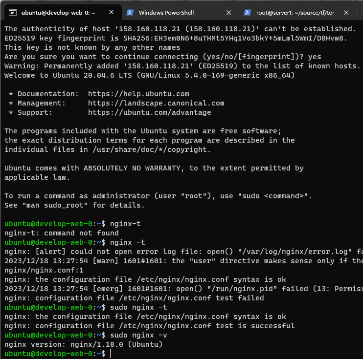
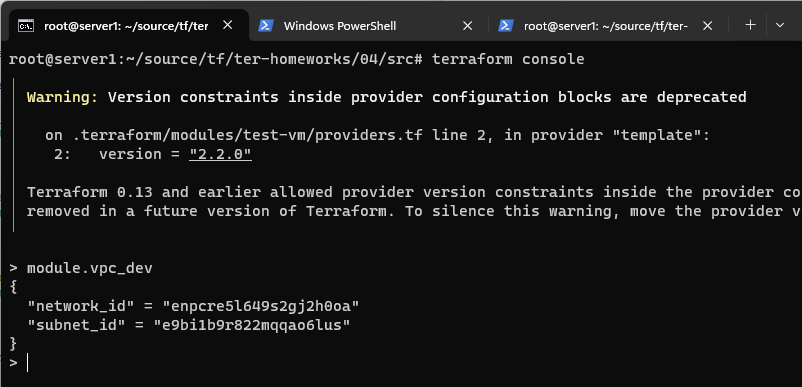
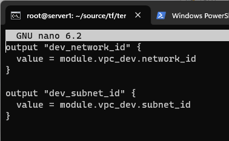
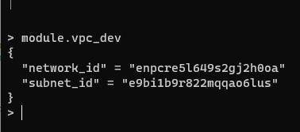
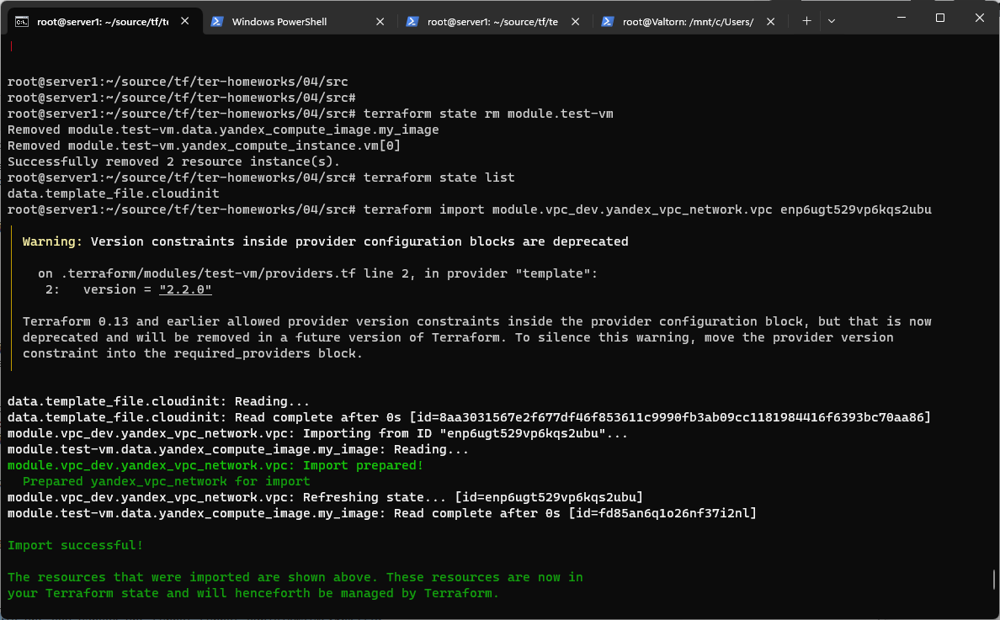
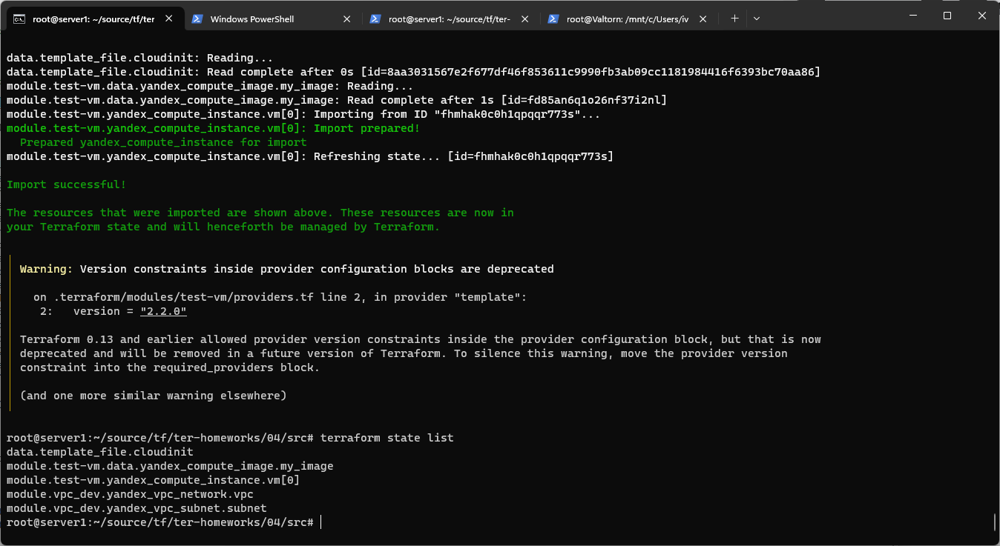
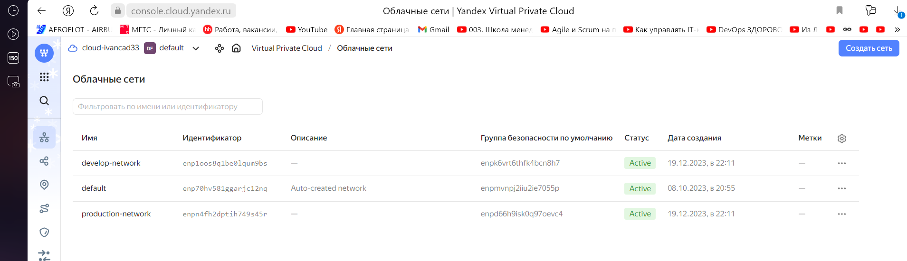
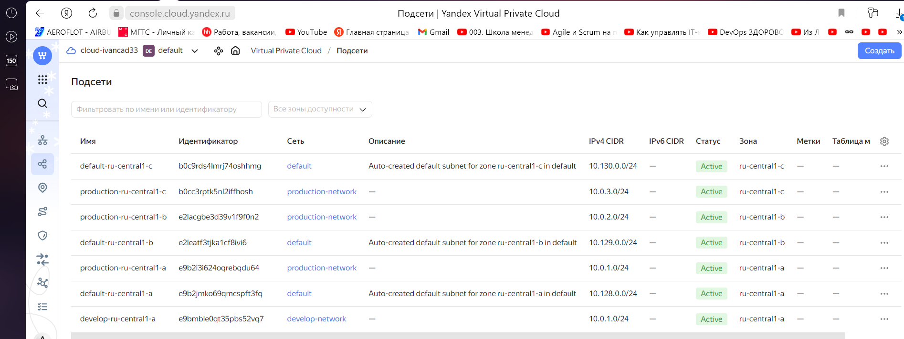

# Домашнее задание к занятию «Продвинутые методы работы с Terraform»

### Задание 1

1. Возьмите из [демонстрации к лекции готовый код](https://github.com/netology-code/ter-homeworks/tree/main/04/demonstration1) для создания ВМ с помощью remote-модуля.
2. Создайте одну ВМ, используя этот модуль. В файле cloud-init.yml необходимо использовать переменную для ssh-ключа вместо хардкода. Передайте ssh-ключ в функцию template_file в блоке vars ={} .
Воспользуйтесь [**примером**](https://grantorchard.com/dynamic-cloudinit-content-with-terraform-file-templates/). Обратите внимание, что ssh-authorized-keys принимает в себя список, а не строку.
3. Добавьте в файл cloud-init.yml установку nginx.
4. Предоставьте скриншот подключения к консоли и вывод команды ```sudo nginx -t```.


### Решение 1

1. Склонировал код из демонстрации.

2. Создам одну ВМ используя модуль. Чтобы создать  одну ВМ нужно  указать параметр ```instance_count  = 1``` в модуле ```test-vm```.

Чтобы передать ssh-ключ используя функцию template_file в vars правлю следующий код 
```console
data "template_file" "cloudinit" {
  template = file("./cloud-init.yml")
  vars     = {
    ssh-authorized-keys = file(var.vms_ssh_root_key[0])
  }
}
```
и добавляю list() в переменной vms_ssh_root_key :
```console

variable "vms_ssh_root_key" {
  type        = list(string)
  default     = ["~/.ssh/id_ed25519.pub"]
  description = "ssh-keygen -t ed25519"
}

```

3. Чтобы установить nginx на хост используя cloud-init.yml, нужно в секцию ```packages``` добавить строку ``` - nginx```.

Проверяю, что nginx установился:




## Задание 2

1. Напишите локальный модуль vpc, который будет создавать 2 ресурса: **одну** сеть и **одну** подсеть в зоне, объявленной при вызове модуля, например: ```ru-central1-a```.
2. Вы должны передать в модуль переменные с названием сети, zone и v4_cidr_blocks.
3. Модуль должен возвращать в root module с помощью output информацию о yandex_vpc_subnet. Пришлите скриншот информации из terraform console о своем модуле. Пример: > module.vpc_dev  
4. Замените ресурсы yandex_vpc_network и yandex_vpc_subnet созданным модулем. Не забудьте передать необходимые параметры сети из модуля vpc в модуль с виртуальной машиной.
5. Откройте terraform console и предоставьте скриншот содержимого модуля. Пример: > module.vpc_dev.
6. Сгенерируйте документацию к модулю с помощью terraform-docs.    
 
Пример вызова

```
module "vpc_dev" {
  source       = "./vpc"
  env_name     = "develop"
  zone = "ru-central1-a"
  cidr = "10.0.1.0/24"
}
```

### Решение 2


1. Создал локальный модуль с одной сетью и  подсетью в ```ru-central1-a```.

2. С использованием переменных с именем сети, зоны и cidr блок:
```console
variable "env_name" {
  type    = string
  description = "Имя облачной сети"
}

variable "zone" {
  type    = string
  description = "Зона, для подсети"
}

variable "cidr" {
  type    = string
  description = "CIDR-блок для подсети"
}
```
3. Terraform console : output  при вызове модуля module.vpc_dev:




module "test-vm" {
  source          = "git::https://github.com/udjin10/yandex_compute_instance.git?ref=main"
  env_name        = "develop"
  network_id      = module.vpc_dev.network_id
  subnet_zones    = ["ru-central1-a"]
  subnet_ids      = [module.vpc_dev.subnet_id]
  
  
  
 4. Заменил сетевые ресурсы созданным модулем:
 
 ```console
 module "test-vm" {
  source          = "git::https://github.com/udjin10/yandex_compute_instance.git?ref=main"
  env_name        = "develop"
  network_id      = module.vpc_dev.network_id
  subnet_zones    = ["ru-central1-a"]
  subnet_ids      = [module.vpc_dev.subnet_id]
 
 ```
 
 5. В root модуле заменил value на module.vpc_dev.
 
 
 
 Вывод module.vpc_dev не изменился:
 
 
 
 
 6. С помощью terraform-docs сгенерировал файл документации. docs.md.
 
```console
 docker run --rm --volume "$(pwd):/terraform-docs" -u $(id -u)\ quay.io/terraform-docs/terraform-docs:0.16.0 markdown /terraform-docs >docs.md
 ```
 
 
 ### Задание 3
1. Выведите список ресурсов в стейте.
2. Полностью удалите из стейта модуль vpc.
3. Полностью удалите из стейта модуль vm.
4. Импортируйте всё обратно. Проверьте terraform plan. Изменений быть не должно.
Приложите список выполненных команд и скриншоты процессы.


### Решение 3

1. Текущий список ресурсов в стейте:

```console
root@server1:~/source/tf/ter-homeworks/04/src# terraform state list
data.template_file.cloudinit
module.test-vm.data.yandex_compute_image.my_image
module.test-vm.yandex_compute_instance.vm[0]
module.vpc_dev.yandex_vpc_network.vpc
module.vpc_dev.yandex_vpc_subnet.subnet
root@server1:~/source/tf/ter-homeworks/04/src#
  ```

2. Удаление из стейта модуля vpc_dev:
```console
root@server1:~/source/tf/ter-homeworks/04/src# terraform state rm module.vpc_dev
Removed module.vpc_dev.yandex_vpc_network.vpc
Removed module.vpc_dev.yandex_vpc_subnet.subnet
Successfully removed 2 resource instance(s).
root@server1:~/source/tf/ter-homeworks/04/src# terraform state list
data.template_file.cloudinit
module.test-vm.data.yandex_compute_image.my_image
module.test-vm.yandex_compute_instance.vm[0]
 ```

3. Удаление из стейта модуля test-vm:
```console
root@server1:~/source/tf/ter-homeworks/04/src# terraform state rm module.test-vm
Removed module.test-vm.data.yandex_compute_image.my_image
Removed module.test-vm.yandex_compute_instance.vm[0]
Successfully removed 2 resource instance(s).
root@server1:~/source/tf/ter-homeworks/04/src# terraform state list
data.template_file.cloudinit
root@server1:~/source/tf/ter-homeworks/04/src#
 ```

4. Импорт удаленных стейтов:
terraform import module.vpc_dev.yandex_vpc_network.vpc enp6ugt529vp6kqs2ubu
terraform import module.vpc_dev.yandex_vpc_subnet.subnet e9bidikma10c86hk277o
terraform import module.test-vm.yandex_compute_instance.vm[0] fhmhak0c0h1qpqqr773s

 


После импорта  модулей изменений нет.



Кода по заданиям 1-3 доcтупен по [ссылке](https://github.com/Elfxf85/devops-netology/tree/terraform-04/6.4tf4/src/1-3).

### Задание 4*

1. Измените модуль vpc так, чтобы он мог создать подсети во всех зонах доступности, переданных в переменной типа list(object) при вызове модуля.  
  
Пример вызова
```
module "vpc_prod" {
  source       = "./vpc"
  env_name     = "production"
  subnets = [
    { zone = "ru-central1-a", cidr = "10.0.1.0/24" },
    { zone = "ru-central1-b", cidr = "10.0.2.0/24" },
    { zone = "ru-central1-c", cidr = "10.0.3.0/24" },
  ]
}

module "vpc_dev" {
  source       = "./vpc"
  env_name     = "develop"
  subnets = [
    { zone = "ru-central1-a", cidr = "10.0.1.0/24" },
  ]
}
```

Предоставьте код, план выполнения, результат из консоли YC.

### Решение 4

1. Изменил модуль vpc, использовал переменную типа list
Terraform plan :
```console
root@server1:~/source/tf/ter-homeworks/04/4# terraform plan
data.template_file.cloudinit: Reading...
data.template_file.cloudinit: Read complete after 0s [id=8aa3031567e2f677df46f853611c9990fb3ab09cc1181984416f6393bc70aa86]
module.test-vm.data.yandex_compute_image.my_image: Reading...
module.test-vm.data.yandex_compute_image.my_image: Read complete after 1s [id=fd85an6q1o26nf37i2nl]

Terraform used the selected providers to generate the following execution plan. Resource actions are indicated with the following symbols:
  + create

Terraform will perform the following actions:

  # module.test-vm.yandex_compute_instance.vm[0] will be created
  + resource "yandex_compute_instance" "vm" {
      + allow_stopping_for_update = true
      + created_at                = (known after apply)
      + description               = "TODO: description; {{terraform managed}}"
      + folder_id                 = (known after apply)
      + fqdn                      = (known after apply)
      + gpu_cluster_id            = (known after apply)
      + hostname                  = "develop-web-0"
      + id                        = (known after apply)
      + labels                    = {
          + "env"     = "develop"
          + "project" = "undefined"
        }
      + metadata                  = {
          + "serial-port-enable" = "1"
          + "user-data"          = <<-EOT
                #cloud-config
                users:
                  - name: ubuntu
                    groups: sudo
                    shell: /bin/bash
                    sudo: ['ALL=(ALL) NOPASSWD:ALL']
                    ssh_authorized_keys:
                      - ssh-ed25519 AAAAC3NzaC1lZDI1NTE5AAAAIKOZ/IIZWc8DojmtWNwNW55sCTFLZLGWqwgQWEe9ixMK root@server1

                package_update: true
                package_upgrade: false
                packages:
                 - nginx
            EOT
        }
      + name                      = "develop-web-0"
      + network_acceleration_type = "standard"
      + platform_id               = "standard-v1"
      + service_account_id        = (known after apply)
      + status                    = (known after apply)
      + zone                      = "ru-central1-a"

      + boot_disk {
          + auto_delete = true
          + device_name = (known after apply)
          + disk_id     = (known after apply)
          + mode        = (known after apply)

          + initialize_params {
              + block_size  = (known after apply)
              + description = (known after apply)
              + image_id    = "fd85an6q1o26nf37i2nl"
              + name        = (known after apply)
              + size        = 10
              + snapshot_id = (known after apply)
              + type        = "network-hdd"
            }
        }

      + network_interface {
          + index              = (known after apply)
          + ip_address         = (known after apply)
          + ipv4               = true
          + ipv6               = (known after apply)
          + ipv6_address       = (known after apply)
          + mac_address        = (known after apply)
          + nat                = true
          + nat_ip_address     = (known after apply)
          + nat_ip_version     = (known after apply)
          + security_group_ids = (known after apply)
          + subnet_id          = (known after apply)
        }

      + resources {
          + core_fraction = 5
          + cores         = 2
          + memory        = 1
        }

      + scheduling_policy {
          + preemptible = true
        }
    }

  # module.vpc_dev.yandex_vpc_network.vpc_net will be created
  + resource "yandex_vpc_network" "vpc_net" {
      + created_at                = (known after apply)
      + default_security_group_id = (known after apply)
      + folder_id                 = (known after apply)
      + id                        = (known after apply)
      + labels                    = (known after apply)
      + name                      = "develop-network"
      + subnet_ids                = (known after apply)
    }

  # module.vpc_dev.yandex_vpc_subnet.vpc_subnet["ru-central1-a"] will be created
  + resource "yandex_vpc_subnet" "vpc_subnet" {
      + created_at     = (known after apply)
      + folder_id      = (known after apply)
      + id             = (known after apply)
      + labels         = (known after apply)
      + name           = "develop-ru-central1-a"
      + network_id     = (known after apply)
      + v4_cidr_blocks = [
          + "10.0.1.0/24",
        ]
      + v6_cidr_blocks = (known after apply)
      + zone           = "ru-central1-a"
    }

  # module.vpc_prod.yandex_vpc_network.vpc_net will be created
  + resource "yandex_vpc_network" "vpc_net" {
      + created_at                = (known after apply)
      + default_security_group_id = (known after apply)
      + folder_id                 = (known after apply)
      + id                        = (known after apply)
      + labels                    = (known after apply)
      + name                      = "production-network"
      + subnet_ids                = (known after apply)
    }

  # module.vpc_prod.yandex_vpc_subnet.vpc_subnet["ru-central1-a"] will be created
  + resource "yandex_vpc_subnet" "vpc_subnet" {
      + created_at     = (known after apply)
      + folder_id      = (known after apply)
      + id             = (known after apply)
      + labels         = (known after apply)
      + name           = "production-ru-central1-a"
      + network_id     = (known after apply)
      + v4_cidr_blocks = [
          + "10.0.1.0/24",
        ]
      + v6_cidr_blocks = (known after apply)
      + zone           = "ru-central1-a"
    }

  # module.vpc_prod.yandex_vpc_subnet.vpc_subnet["ru-central1-b"] will be created
  + resource "yandex_vpc_subnet" "vpc_subnet" {
      + created_at     = (known after apply)
      + folder_id      = (known after apply)
      + id             = (known after apply)
      + labels         = (known after apply)
      + name           = "production-ru-central1-b"
      + network_id     = (known after apply)
      + v4_cidr_blocks = [
          + "10.0.2.0/24",
        ]
      + v6_cidr_blocks = (known after apply)
      + zone           = "ru-central1-b"
    }

  # module.vpc_prod.yandex_vpc_subnet.vpc_subnet["ru-central1-c"] will be created
  + resource "yandex_vpc_subnet" "vpc_subnet" {
      + created_at     = (known after apply)
      + folder_id      = (known after apply)
      + id             = (known after apply)
      + labels         = (known after apply)
      + name           = "production-ru-central1-c"
      + network_id     = (known after apply)
      + v4_cidr_blocks = [
          + "10.0.3.0/24",
        ]
      + v6_cidr_blocks = (known after apply)
      + zone           = "ru-central1-c"
    }

Plan: 7 to add, 0 to change, 0 to destroy.

Changes to Outputs:
  + dev_network_id = (known after apply)
  + dev_subnet_id  = (known after apply)
```

В YC создались 2 сети develop , production и подсети  3 prod 1 dev:




# Листинг кода по заданию 4 можно посмотреть по [ссылке](https://github.com/Elfxf85/devops-netology/tree/terraform-04/6.4tf4/src/4).