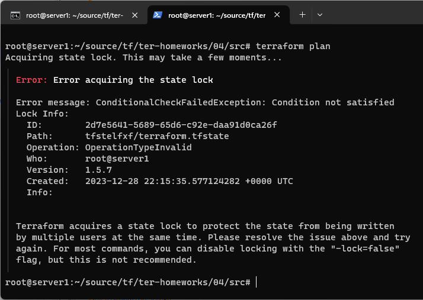
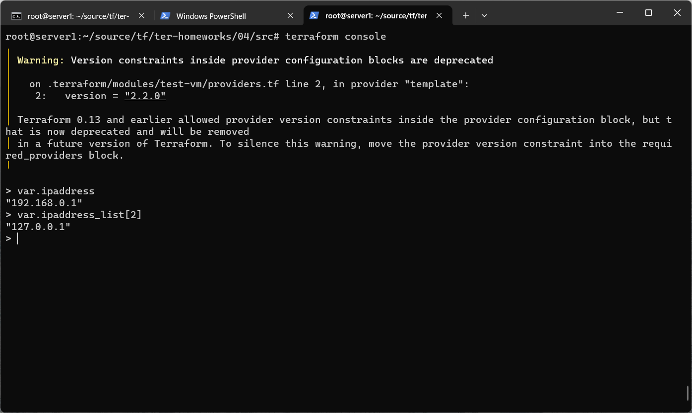
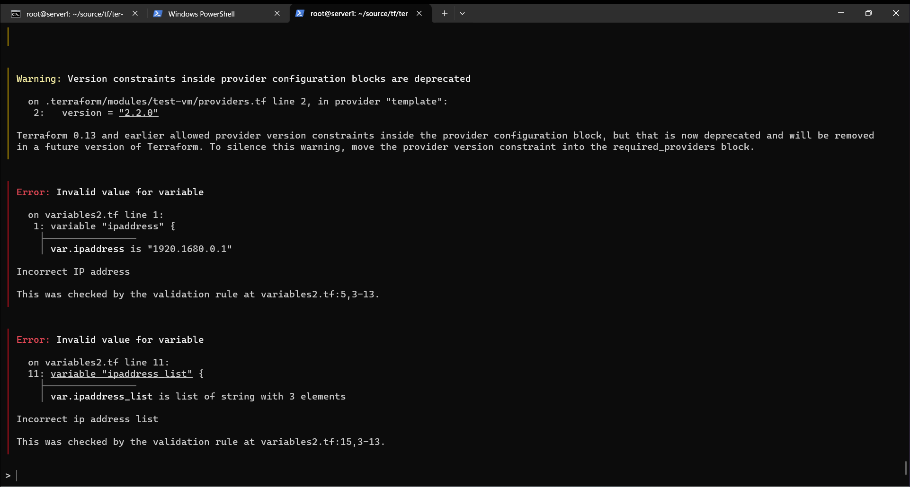

# Домашнее задание к занятию «Использование Terraform в команде»

### Задание 1

1. Возьмите код:
- из [ДЗ к лекции 4](https://github.com/netology-code/ter-homeworks/tree/main/04/src),
- из [демо к лекции 4](https://github.com/netology-code/ter-homeworks/tree/main/04/demonstration1).
2. Проверьте код с помощью tflint и checkov. Вам не нужно инициализировать этот проект.
3. Перечислите, какие **типы** ошибок обнаружены в проекте (без дублей).

### Решение 1

1-2. С помощью docker контейнера tflint проверяю первый код :
docker run --rm -v "$(pwd):/tflint" ghcr.io/terraform-linters/tflint:v0.46.0 /tflint

С помощью checkov проверяю ошибки во втором коде:

docker pull bridgecrew/checkov
docker run --rm --tty --volume $(pwd):/tf --workdir /tf bridgecrew/checkov \
--download-external-modules true --directory /tf

3. Обнаружены следующие ошибки:
- Не был инициализирован проект, соответственно нет установленного Terraform провайдера,
 -есть объявленные, но неиспользуемые переменные,
 
 - в модуле test-vm присутствует ссылка на ветку main без указания конкретного коммита. 
  Check: CKV_TF_1: "Ensure Terraform module sources use a commit hash"
        FAILED for resource: test-vm
что делает код уязвимым для атаки по цепочке сборок. Поэтому рекомендуется использовать URL-адреса Git с хеш-версией фиксации, чтобы гарантировать неизменность и согласованность.  

### Задание 2

1. Возьмите ваш GitHub-репозиторий с **выполненным ДЗ 4** в ветке 'terraform-04' и сделайте из него ветку 'terraform-05'.
2. Повторите демонстрацию лекции: настройте YDB, S3 bucket, yandex service account, права доступа и мигрируйте state проекта в S3 с блокировками. Предоставьте скриншоты процесса в качестве ответа.
3. Закоммитьте в ветку 'terraform-05' все изменения.
4. Откройте в проекте terraform console, а в другом окне из этой же директории попробуйте запустить terraform apply.
5. Пришлите ответ об ошибке доступа к state.
6. Принудительно разблокируйте state. Пришлите команду и вывод.

### Решение 2

1. Сделал копию репозитория прошлого ДЗ.
2. Создал S3 bucket, yandex service account, назначил права доступа, YDB:

3. Закоммитил изменения в ветку terraform-05. [Ссылка](https://github.com/Elfxf85/devops-netology/tree/terraform-04/6.4tf4/src).

4. Открываю terraform console, а в другом окне из этой же директории запускаю terraform apply.

5. Ответ об ошибке доступа к state:

6. Принудительно разблокирую state:

### Задание 4

1. Напишите переменные с валидацией и протестируйте их, заполнив default верными и неверными значениями. Предоставьте скриншоты проверок из terraform console. 

- type=string, description="ip-адрес" — проверка, что значение переменной содержит верный IP-адрес с помощью функций cidrhost() или regex(). Тесты:  "192.168.0.1" и "1920.1680.0.1";
  - type=list(string), description="список ip-адресов" — проверка, что все адреса верны. Тесты:  ["192.168.0.1", "1.1.1.1", "127.0.0.1"] и ["192.168.0.1", "1.1.1.1", "1270.0.0.1"].

### Решение 4

1. Написал переменные с валидацией:
Если в адресах нет ошибок, то console выведет  результат без ошибок.

Если в адресах есть ошибки, то terraform console выведет результат с ошибками:

