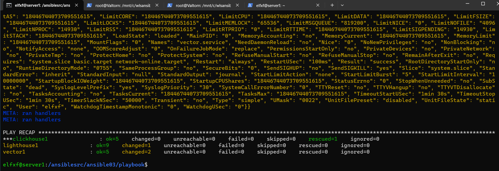

# Домашнее задание к занятию 3 «Использование Ansible»

## Подготовка к выполнению

1. Для выполнения ДЗ создал 3 виртуальные машины в Yandex.Cloud 


## Основная часть

1. Допишите playbook: нужно сделать ещё один play, который устанавливает и настраивает LightHouse.
2. При создании tasks рекомендую использовать модули: `get_url`, `template`, `yum`, `apt`.
3. Tasks должны: скачать статику LightHouse, установить Nginx или любой другой веб-сервер, настроить его конфиг для открытия LightHouse, запустить веб-сервер.
4. Подготовьте свой inventory-файл `prod.yml`.
5. Запустите ansible-lint site.yml и исправьте ошибки, если они есть.
6. Попробуйте запустить playbook на этом окружении с флагом `--check`.
7. Запустите playbook на `prod.yml` окружении с флагом `--diff`. Убедитесь, что изменения на системе произведены.
8. Повторно запустите playbook с флагом `--diff` и убедитесь, что playbook идемпотентен.
9. Подготовьте README.md-файл по своему playbook. В нём должно быть описано: что делает playbook, какие у него есть параметры и теги.
10. Готовый playbook выложите в свой репозиторий, поставьте тег `08-ansible-03-yandex` на фиксирующий коммит, в ответ предоставьте ссылку на него.

---

## Решение Основой части
1,2, 3. Дописал еще один play, который устанавливает LightHouse, используя модули  `get_url`, `template`, `yum`, `service`. Происходит установка и конфигурирование веб-сервера Nginx, установка и конфигурирование LightHouse, запуск служб Nginx и LightHouse.

4. Подготовил prod inventory-файл `prod.yml`:


5. Запустил ansible-lint site.yml. Были ошибки в использовании старых наименований модулей, отсутствии прав на скачиваемые  файлы: исправил.

6. Запустил playbook с флагом `--check`. При выполнение playbook вышла ошибка,

 т.к. этот флаг не вносит изменения в системы, а выполнение playbook требует скачивания и установки пакетов приложений.
```console
ansible-playbook -i inventory/prod.yml site.yml --check
```


7. Запускаю playbook на `prod.yml` окружении с флагом `--diff`. Изменения в систему внесены:
```console
ansible-playbook -i inventory/prod.yml site.yml --diff
```


8. Повторно запускаю playbook с флагом `--diff`. Playbook идемпотентен:
 -  Changed на lighthouse связаны с пересозданием папки из за "recurse: true" и так же рекурсивным клонированием  репо из git  из за "force: true" 
иначе без этой директивы palybook падает при повторном выполнении из за существуюхих фаилов в локальной директории репо, а так он их перезаписывает.
 - Changed на хосте Vector1 связаны с его рестартом  из за  "daemon_reload: true"


9. Подготовил README.md-файл по своему playbook. Ссылка: https://github.com/Elfxf85/devops-netology/blob/main/7.3ansible/src/README.md

