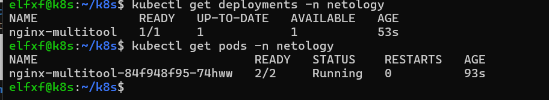

# Домашнее задание к занятию «Запуск приложений в K8S»

### Задание 1. Создать Deployment и обеспечить доступ к репликам приложения из другого Pod

1. Создать Deployment приложения, состоящего из двух контейнеров — nginx и multitool. Решить возникшую ошибку.
2. После запуска увеличить количество реплик работающего приложения до 2.
3. Продемонстрировать количество подов до и после масштабирования.
4. Создать Service, который обеспечит доступ до реплик приложений из п.1.
5. Создать отдельный Pod с приложением multitool и убедиться с помощью `curl`, что из пода есть доступ до приложений из п.1.

------

### Задание 2. Создать Deployment и обеспечить старт основного контейнера при выполнении условий

1. Создать Deployment приложения nginx и обеспечить старт контейнера только после того, как будет запущен сервис этого приложения.
2. Убедиться, что nginx не стартует. В качестве Init-контейнера взять busybox.
3. Создать и запустить Service. Убедиться, что Init запустился.
4. Продемонстрировать состояние пода до и после запуска сервиса.

------

### Решение задания 1. Создать Deployment и обеспечить доступ к репликам приложения из другого Pod

1. Создаю отдельный Namespace для того, чтобы созданные в этом задании поды, деплойменты, сервисы работали отдельно от остальных, ранее созданных:

Пишу манифест Deployment приложения, состоящего из двух контейнеров — nginx и multitool. Поскольку  порты 80, 443  заняты , то запуск multitool потребует указания альтернативного порта. Для этого в манифест Deployment добавляю переменную с указанием порта 1180.

Запускаю Deployment:

Проверяю результат:

2. Сейчас запущена одна реплика приложения nginx-multitool. Увеличу количество реплик до двух и проверю результат:

Видно, что количество реплик в AVAILABLE увеличилось до двух и обе запущены.

3. До масштабирования  был один под:

После масштабирования стало два пода:

4. Пишу манифест Service с именем nginx-multitool-svc в namespace netology. Применяю манифест:

Проверяю сервисы в namespace netology:

Сервис создан.

5. Пишу манифест отдельного пода multitool в namespace netology. Применяю манифест:

Проверяю поды в namespace netology:

Видно, что под с именем multitool был создан и запущен.

С помощью `curl`, проверяю, есть ли из пода multitool доступ до приложений из п.1.:

При обращении на порт 80 сервиса ответил запущенный nginx.

При обращении на порт 8080 сервиса ответил запущенный multitool.

Ссылка на манифест Deployment -https://github.com/Elfxf85/devops-netology/blob/main/K8S-1.3/SRC/deployment.yaml

Ссылка на манифест Service -  https://github.com/Elfxf85/devops-netology/blob/main/K8S-1.3/SRC/service.yaml

Ссылка на манифест с подом multitool -  https://github.com/Elfxf85/devops-netology/blob/main/K8S-1.3/SRC/multitool.yaml

---

### Решение задания 2. Создать Deployment и обеспечить старт основного контейнера при выполнении условий

1 - 2. Создаю манифест Deployment приложения nginx, который запустится только после запуска сервиса. В качестве Init-контейнера использую busybox:

Deployment создан, проверю запущен ли под:

Вижу, что под не запущен и находится в состоянии `Init:0/1`.

3 - 4. Создаю манифест Service, применяю его и проверю запустился ли под nginx:

После запуска сервиса, запустился под с nginx.

Ссылка на манифест Deployment - https://github.com/Elfxf85/devops-netology/blob/main/K8S-1.3/SRC/nginx-init-deploy.yaml

Ссылка на манифест Service - https://github.com/Elfxf85/devops-netology/blob/main/K8S-1.3/SRC/nginx-init-svc.yaml