# Домашнее задание к занятию «Сетевое взаимодействие в K8S. Часть 2»

### Задание 1. Создать Deployment приложений backend и frontend

1. Создать Deployment приложения _frontend_ из образа nginx с количеством реплик 3 шт.
2. Создать Deployment приложения _backend_ из образа multitool.
3. Добавить Service, которые обеспечат доступ к обоим приложениям внутри кластера. 
4. Продемонстрировать, что приложения видят друг друга с помощью Service.
5. Предоставить манифесты Deployment и Service в решении, а также скриншоты или вывод команды п.4.

------

### Задание 2. Создать Ingress и обеспечить доступ к приложениям снаружи кластера

1. Включить Ingress-controller в MicroK8S.
2. Создать Ingress, обеспечивающий доступ снаружи по IP-адресу кластера MicroK8S так, чтобы при запросе только по адресу открывался _frontend_ а при добавлении /api - _backend_.
3. Продемонстрировать доступ с помощью браузера или `curl` с локального компьютера.
4. Предоставить манифесты и скриншоты или вывод команды п.2.

------

### Решение Задания 1. Создать Deployment приложений backend и frontend

1. Для выполнения задания создам отдельный Namespace. Пишу манифест Deployment приложения _frontend_ из образа nginx с количеством реплик 3 шт:

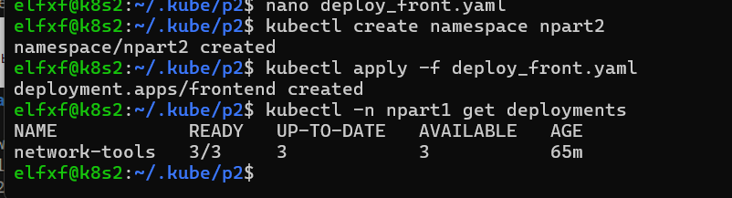

2. Пишу манифест Deployment приложения _backend_ из образа multitool:

Проверю созданные поды:

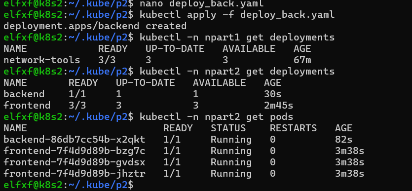

Поды созданы, количество реплик соответствуют заданию.

3. Пишу манифест Service, который обеспечит доступ к обоим приложениям внутри кластера:

Так как имена приложений в Deployments разные, для связи сервиса с деплойментами буду использовать selector типа component.

Применю сервис и проверю его состояние:

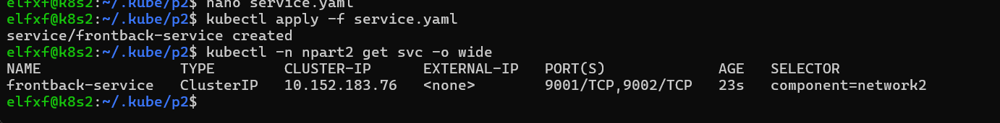

4. Используя curl, проверю, видят ли приложения друг друга через созданный сервис из пода backend:

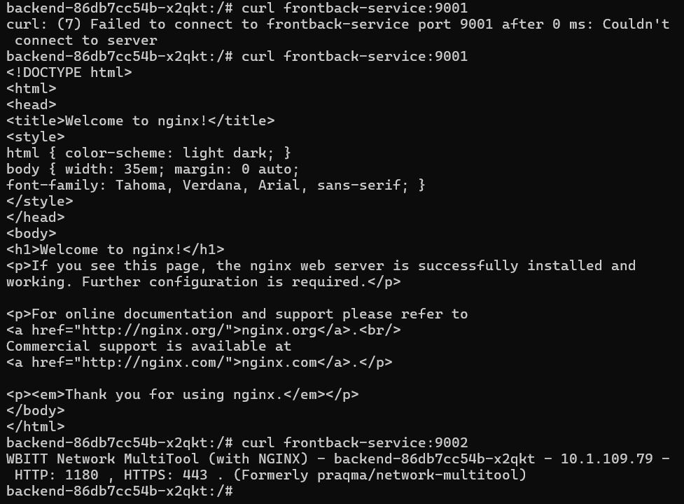

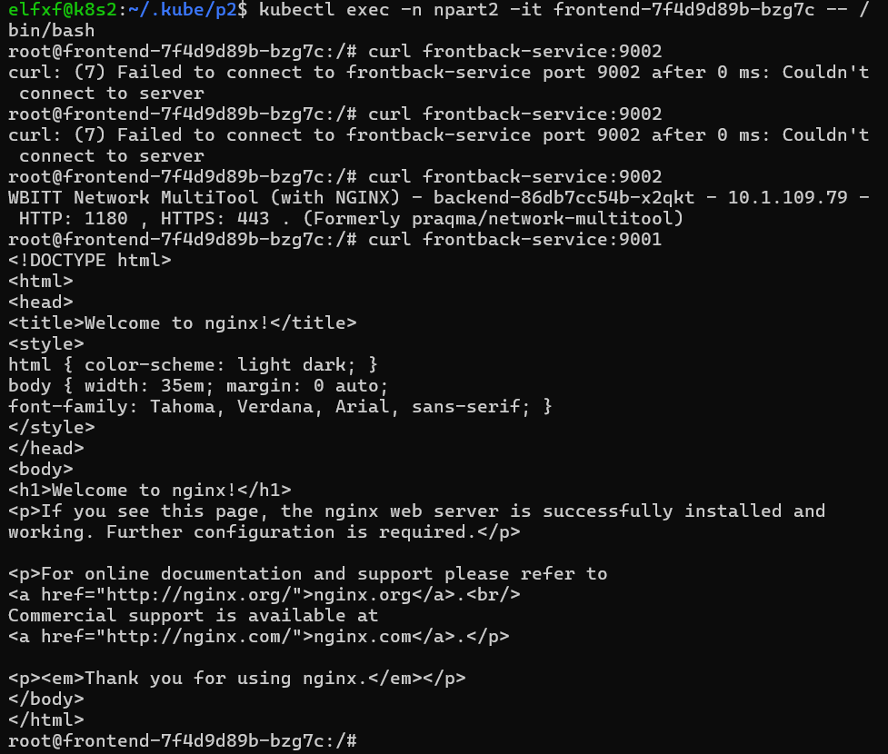

Приложения видят друг друга.

5. Ссылка на манифест Deployment c frontend - https://github.com/Elfxf85/devops-netology/blob/main/K8S-1.5/SRC/deploy_front.yaml

Ссылка на манифест Deployment c backend - https://github.com/Elfxf85/devops-netology/blob/main/K8S-1.5/SRC/deploy_back.yaml

Ссылка на манифест Service - https://github.com/Elfxf85/devops-netology/blob/main/K8S-1.5/SRC/service.yaml

------

### Решение задания 2. Создать Ingress и обеспечить доступ к приложениям снаружи кластера

1. Включаю Ingress-controller в MicroK8S. Проверю его состояние:

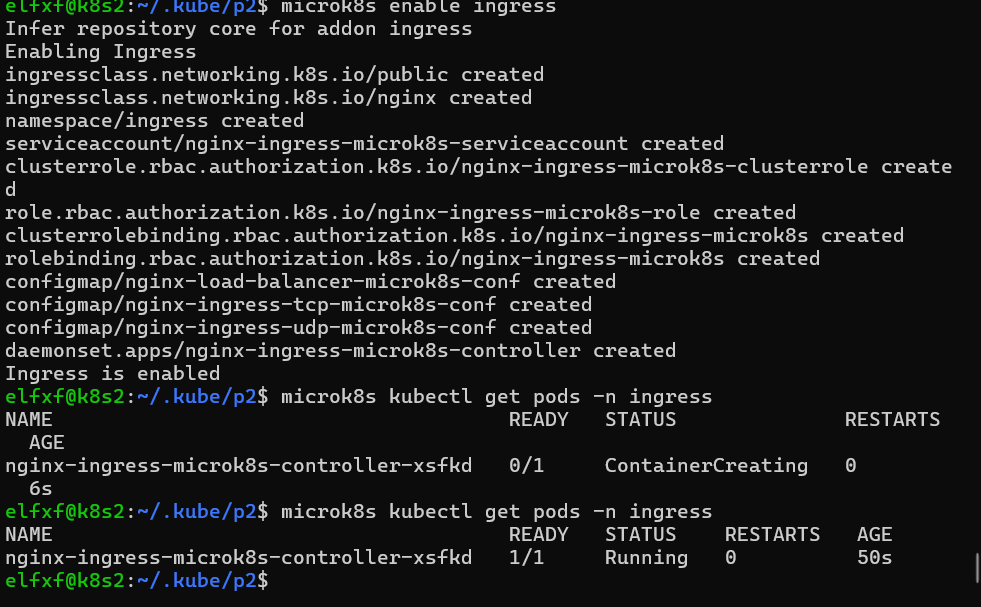

Ingress-controller запущен.

2. Пишу манифест Ingress, обеспечивающий доступ снаружи по IP-адресу кластера MicroK8S так, чтобы при запросе только по адресу открывался _frontend_ а при добавлении /api - _backend_.

Применю манифест и проверю результат:

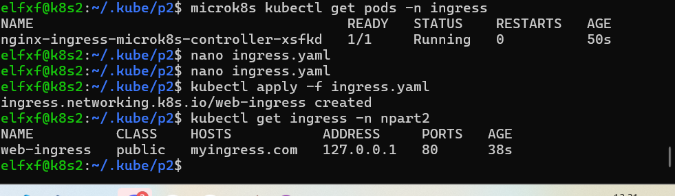

Ingress создан.

3. Для проверки доступа с помощью браузера или `curl` с локального компьютера, добавлю в DNS соответствующую запись так, чтобы примененный в Ingress адрес myingress.com ссылался на IP адрес кластера MicroK8S.

Проверяю доступ к приложениям через Ingress:

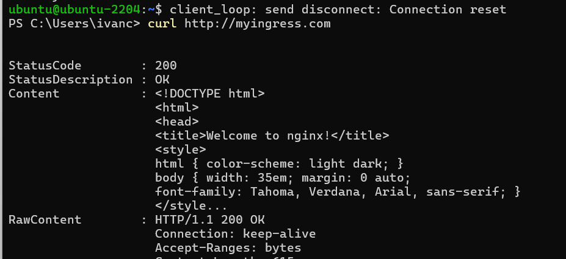
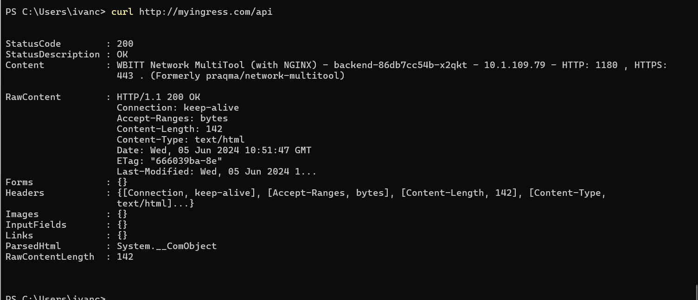
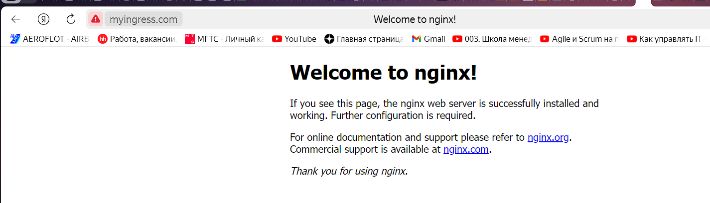

При обращении к http://myingress.com/ получаю ответ от Nginx, при обращении к http://myingress.com/api получаю ответ от Multitool.
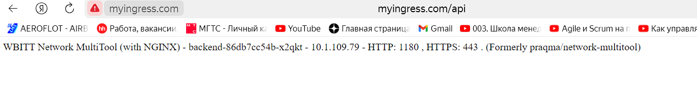

4. Ссылка на манифест Ingress - https://github.com/Elfxf85/devops-netology/blob/main/K8S-1.5/SRC/ingress.yaml