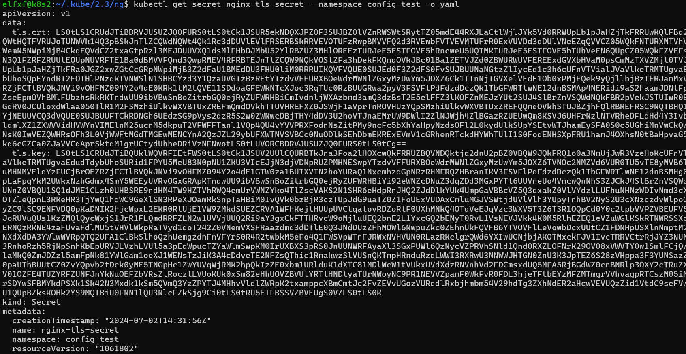

# Домашнее задание к занятию «Конфигурация приложений»

### Задание 1. Создать Deployment приложения и решить возникшую проблему с помощью ConfigMap. Добавить веб-страницу

1. Создать Deployment приложения, состоящего из контейнеров nginx и multitool.
2. Решить возникшую проблему с помощью ConfigMap.
3. Продемонстрировать, что pod стартовал и оба конейнера работают.
4. Сделать простую веб-страницу и подключить её к Nginx с помощью ConfigMap. Подключить Service и показать вывод curl или в браузере.
5. Предоставить манифесты, а также скриншоты или вывод необходимых команд.

------

### Задание 2. Создать приложение с вашей веб-страницей, доступной по HTTPS 

1. Создать Deployment приложения, состоящего из Nginx.
2. Создать собственную веб-страницу и подключить её как ConfigMap к приложению.
3. Выпустить самоподписной сертификат SSL. Создать Secret для использования сертификата.
4. Создать Ingress и необходимый Service, подключить к нему SSL в вид. Продемонстировать доступ к приложению по HTTPS. 
4. Предоставить манифесты, а также скриншоты или вывод необходимых команд.

------

### Выполнение задания 1. Создать Deployment приложения и решить возникшую проблему с помощью ConfigMap. Добавить веб-страницу

1. Cоздам Deployment приложения, состоящего из контейнеров nginx и multitool.

Применю манифест Deployment и вижу, что один из контейнеров пода не запустился:


2. Причина заключается в том, что стандартный порт, который используется в multitool уже занят, поэтому нужно использовать альтернативный порт. Этот альтернативный порт укажу в виде переменной `HTTP_PORT` в ConfigMap и укажу значение  равное `1180`.

3. Применю манифест ConfigMap и проверю изменилось ли состояние контейнера multitool в созданном поде:


Контейнер запустился, так как проблемная ситуация с портом контейнера была решена.

4. Сделаю простую веб-страницу и подключу её к Nginx с помощью ConfigMap. Для этого модернизирую Deployment, добавив в него volumeMounts ссылающийся на путь по умолчанию для nginx, где находится индексная страница - /usr/share/nginx/html/, а также сошлюсь на сам ConfigMap. Подключаю Service и применяю ConfigMap.

Проверю, покажет ли nginx из  пода созданную мной простую индексную страницу:


Текст индексной страницы, из  ConfigMap и текст индексной страницы из контейнера пода одинаковы, следовательно она взята из содержимого ConfigMap.

5. Ссылка на манифест Deployment - https://github.com/Elfxf85/devops-netology/blob/main/K8S-2.3/SRC/deployment.yaml

   Ссылка на манифест Service - https://github.com/Elfxf85/devops-netology/blob/main/K8S-2.3/SRC/service.yaml

   Ссылка на манифест ConfigMap - https://github.com/Elfxf85/devops-netology/blob/main/K8S-2.3/SRC/configmap.yaml

   ------

### Выполнение задания 2. Создать приложение с вашей веб-страницей, доступной по HTTPS 

1. Пишу манифест Deployment приложения, состоящего из Nginx

Манифест похож на тот, что использовался в первом задании. Также используется volumeMounts, указывающий на расположение стандартной индексной страницы nginx.

2. Создаю собственную веб-страницу и подключаю её как ConfigMap к приложению. В Deployment ссылаюсь на имя, указанное в ConfigMap.

3. Выпускаю самоподписной сертификат SSL:


 Создаю Secret для использования сертификата:



Проверю, действительно ли создан секрет:


Секрет создан.

4. 
Применяем измененные файлы
```
kubectl apply -f nginx_configmap.yaml
kubectl apply -f nginx_deployment.yaml
kubectl apply -f ingress.yaml
kubectl apply -f ngnix_svc.yaml
```
Проверю доступ к сайту по HTTPS:


Сайт открывается, текст страницы взят из ConfigMap. Сертификат сайта подключен:


5. Ссылка на манифест Deployment - https://github.com/Elfxf85/devops-netology/blob/main/K8S-2.3/SRC/nginx_deployment.yaml

   Ссылка на манифест ConfigMap - https://github.com/Elfxf85/devops-netology/blob/main/K8S-2.3/SRC/nginx_configmap.yaml

   Ссылка на манифест Service - https://github.com/Elfxf85/devops-netology/blob/main/K8S-2.3/SRC/ngnix_svc.yaml
 
   Ссылка на манифест Ingress - https://github.com/Elfxf85/devops-netology/blob/main/K8S-2.3/SRC/ingress.yaml