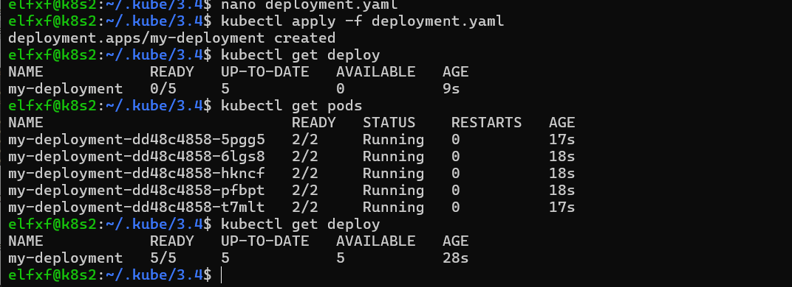
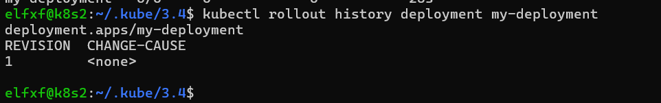
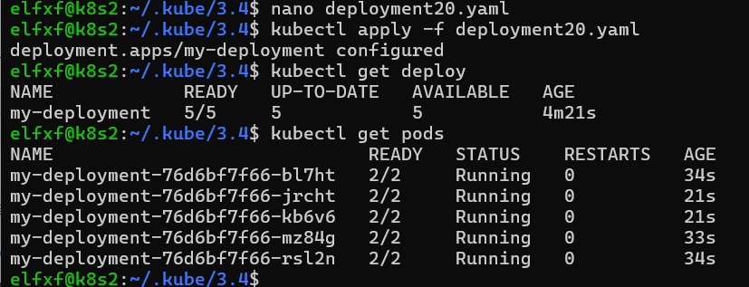
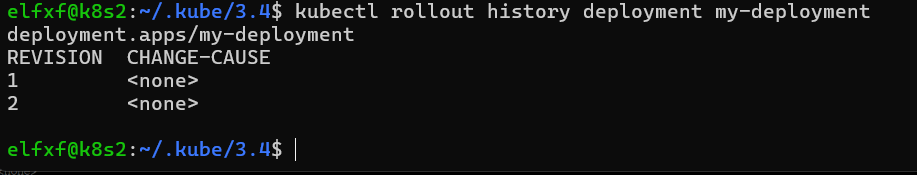
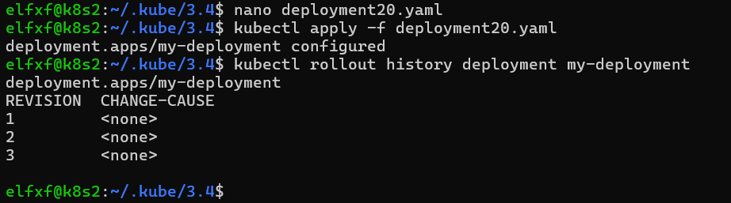
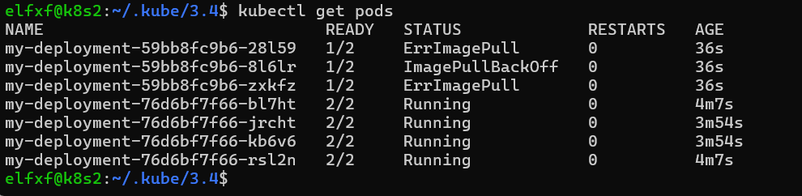
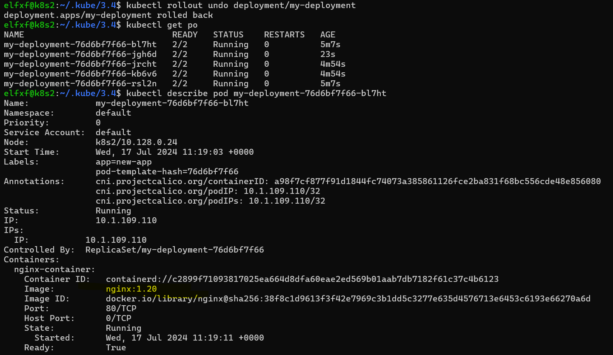
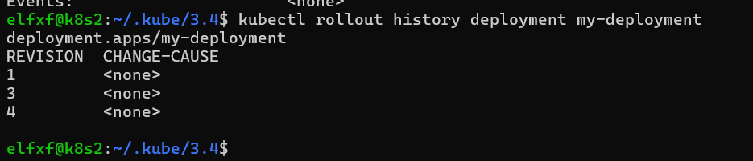

# Домашнее задание к занятию «Обновление приложений»

### Задание 1. Выбрать стратегию обновления приложения и описать ваш выбор

1. Имеется приложение, состоящее из нескольких реплик, которое требуется обновить.
2. Ресурсы, выделенные для приложения, ограничены, и нет возможности их увеличить.
3. Запас по ресурсам в менее загруженный момент времени составляет 20%.
4. Обновление мажорное, новые версии приложения не умеют работать со старыми.
5. Вам нужно объяснить свой выбор стратегии обновления приложения.

### Задание 2. Обновить приложение

1. Создать deployment приложения с контейнерами nginx и multitool. Версию nginx взять 1.19. Количество реплик — 5.
2. Обновить версию nginx в приложении до версии 1.20, сократив время обновления до минимума. Приложение должно быть доступно.
3. Попытаться обновить nginx до версии 1.28, приложение должно оставаться доступным.
4. Откатиться после неудачного обновления.

## Дополнительные задания — со звёздочкой*

Задания дополнительные, необязательные к выполнению, они не повлияют на получение зачёта по домашнему заданию. **Но мы настоятельно рекомендуем вам выполнять все задания со звёздочкой.** Это поможет лучше разобраться в материале.   

### Задание 3*. Создать Canary deployment

1. Создать два deployment'а приложения nginx.
2. При помощи разных ConfigMap сделать две версии приложения — веб-страницы.
3. С помощью ingress создать канареечный деплоймент, чтобы можно было часть трафика перебросить на разные версии приложения.

### Выполнение задания 1. Выбрать стратегию обновления приложения и описать ваш выбор
Главным  условием в данном кейсе является невозможность параллельной работы старой и новой версии, а также ограниченность ресурсов, которая не дает возможности увеличить количество подов с приложением. Также  у нас отсутствет требование 100% доступности приложения для пользователей.

Это значит, что мы можем одномоментно заменить все поды со старой версией новым деплойментом, а следовательно оптимальным решением будет стратегия обновления Recreate.

При анализе альтернативных стратегий вариантов замены Recreate не выявлено, так как Rolling update нам не подходит по причине несовместимости версий, а Blue-green не подходит из-за ограниченности вычислительных ресурсов.

### Выполнение задания 2. Обновить приложение

1. Создать deployment приложения с контейнерами nginx и multitool. Версию nginx взять 1.19. Количество реплик — 5.

Создаем файл `deployment.yaml`
```yml
apiVersion: apps/v1
kind: Deployment
metadata:
  name: my-deployment
spec:
  replicas: 5
  selector:
    matchLabels:
      app: new-app
  template:
    metadata:
      labels:
        app: new-app
    spec:
      containers:
      - name: nginx-container
        image: nginx:1.19
        ports:
        - containerPort: 80
      - name: multitool-container
        image: wbitt/network-multitool:latest
        ports:
        - containerPort: 8080
        env:
          - name: HTTP_PORT
            value: "1180"
```
Разворачиваем наш деплой и проверяем результат
```
kubectl apply -f deployment.yaml
kubectl get deploy
kubectl get pods
```



Смотрим историю обновлений, аналогично примеру, показанному в лекции
```
kubectl rollout history deployment my-deployment
```



2. Обновить версию nginx в приложении до версии 1.20, сократив время обновления до минимума. Приложение должно быть доступно.

Заменяем версию `nginx`  c `1.19` до `1.20`, для чего корректируем данный блок кода в `deployment.yaml`
```
containers:
      - name: nginx-container
        image: nginx:1.20
```
Применяем изменения
```
kubectl apply -f deployment.yaml
```
Поскольку в конфигурации нашего приложения отдельно никак не прописана стратегия обновления, то применяется стандартная `rolling update`, которая заменяет одни поды (более станая версия приложения) на другие (более новая версия приложения).

Поды обновляются постепенно и наше приложение остается постоянно доступно




Проверяем, что появилась вторая версия прилоржения
```
kubectl rollout history deployment my-deployment
```



3. Попытаться обновить nginx до версии 1.28, приложение должно оставаться доступным.

Обновляемся аналогично предыдущему пункту
```
containers:
      - name: nginx-container
        image: nginx:1.28
```
Применяем извенения, хоть и знаем, что версии 1.28 [не существует](https://docs.nginx.com/nginx/releases/).
```
kubectl apply -f deployment.yaml
kubectl rollout history deployment my-deployment
```




Как видно, обновление завершилось ошибкой скачивания образа, но приложение осталось доступным на старой версии, благодаря дефолтной политике обновления (если возникают проблемы с новой версией, то предыдущие поды
не приостанавливаются).

4. Откатиться после неудачного обновления.
```
kubectl rollout undo deployment/my-deployment
```

Проверяем, что все поды в статусе `running`, а также то, что мы откатились к версии `1.20`
```
kubectl get po
kubectl describe pod my-deployment-76d6bf7f66-5ps2k
```



Проверяем, что появилась новая (четвертая) версия приложения, а вторая пропала, так как они идентичны.
```
kubectl rollout history deployment my-deployment
```



Манифест [deployment.yaml](https://githubt.yaml)


### Задание 3*. Создать Canary deployment

Не сделал