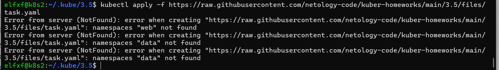
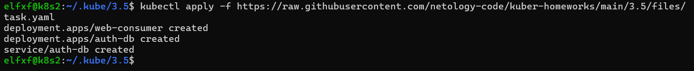
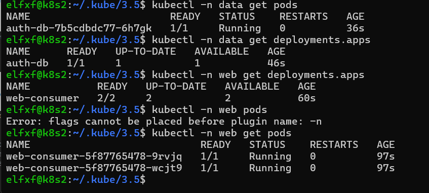
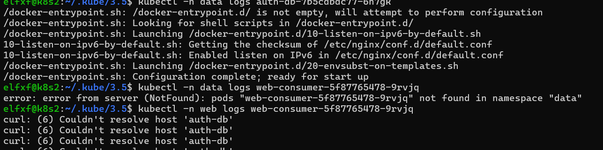
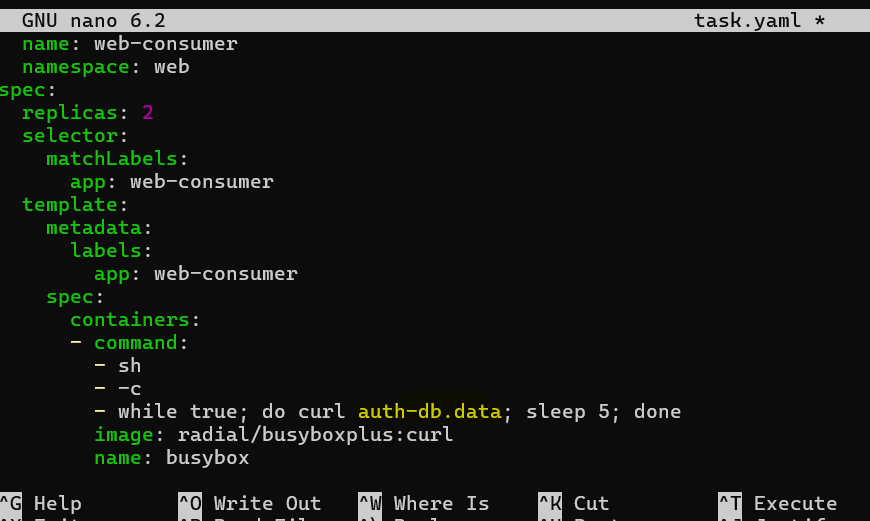
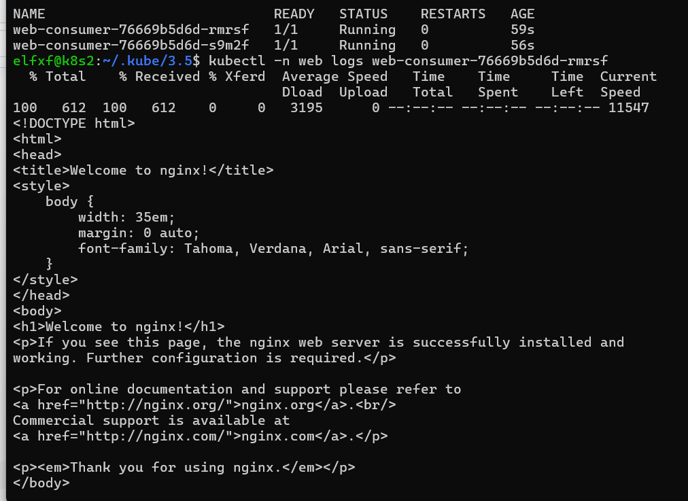
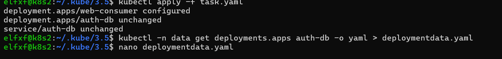
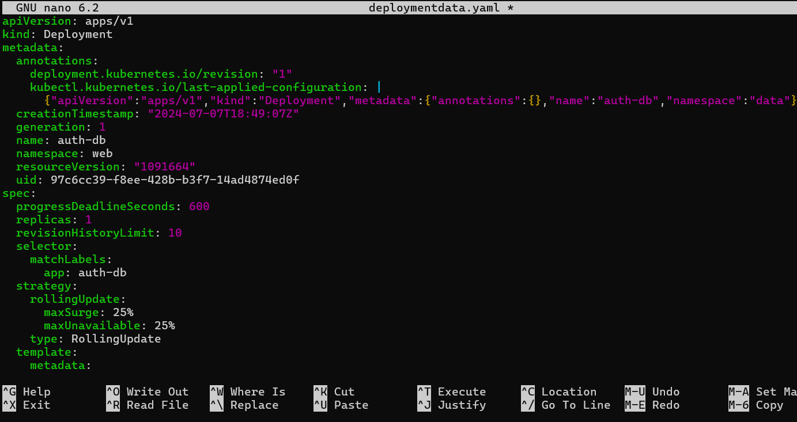
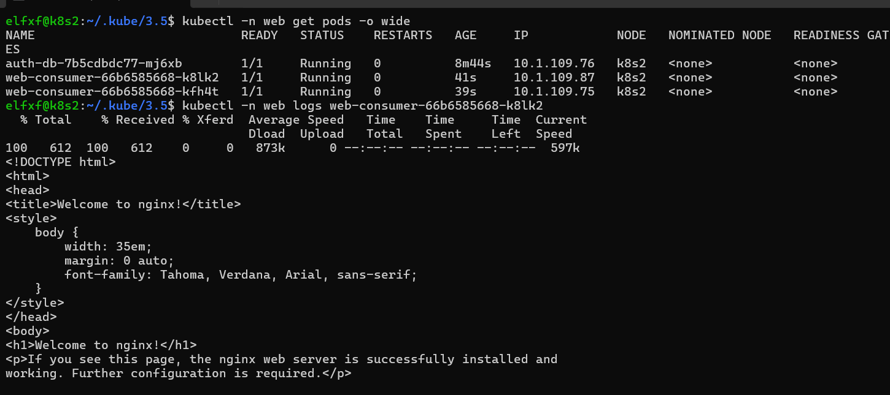

# Домашнее задание к занятию Troubleshooting

### Задание. При деплое приложение web-consumer не может подключиться к auth-db. Необходимо это исправить

1. Установить приложение по команде:
```shell
kubectl apply -f https://raw.githubusercontent.com/netology-code/kuber-homeworks/main/3.5/files/task.yaml
```
2. Выявить проблему и описать.
3. Исправить проблему, описать, что сделано.
4. Продемонстрировать, что проблема решена.

### Выполнение задания. При деплое приложение web-consumer не может подключиться к auth-db. Необходимо это исправить

1. Устанавливаю приложение по указанной команде. Сразу вижу, что в кластере нет указанных в манифесте namespace:



Создаю namespace и продолжаю установку приложения:



Проверю статус deployments и pods:



Deployments и pods запущены, ошибок нет.

2. Проверяю статус  приложений внутри подов. Проверять буду с помощью просмотра логов подов:



Видно, что в приложении деплоймента auth-db все в порядке, но с приложением деплоймента web-consumer есть проблема, а не может достучаться до auth-db по имени хоста.

Причина проблемы в том, что деплойменты находятся в разных namespace.

3. Для исправления проблемы есть несколько возможных способов решения, приведу два:

* Первый способ:

Отредактировать манифест деплоймента web-consumer и в строке команды curl auth-db заменить на curl auth-db.data:



После перезапуска деплоймента выполнение команды в поде web-consumer выполняется успешно:



Допустимый способ исправления проблемы, если деплойменты действительно должны находиться в разных namespaces.

* Второй способ:

Редактируем манифест деплоймента web-consumer и возвращаем его к первоначальному виду, заменив curl auth-db.data на curl auth-db.

Получаем манифест деплоймента auth-db в виде yaml файла и меняем в нем namespace с data на web:





Применяю манифест обновленного деплоймента и проверю логи пода web-consumer:



Приложение в поде работает корректно, команда curl auth-db выполняется каждые 5 секунд.

Считаю этот способ исправления проблемы наиболее правильным. Проблема решена, задание выполнено.