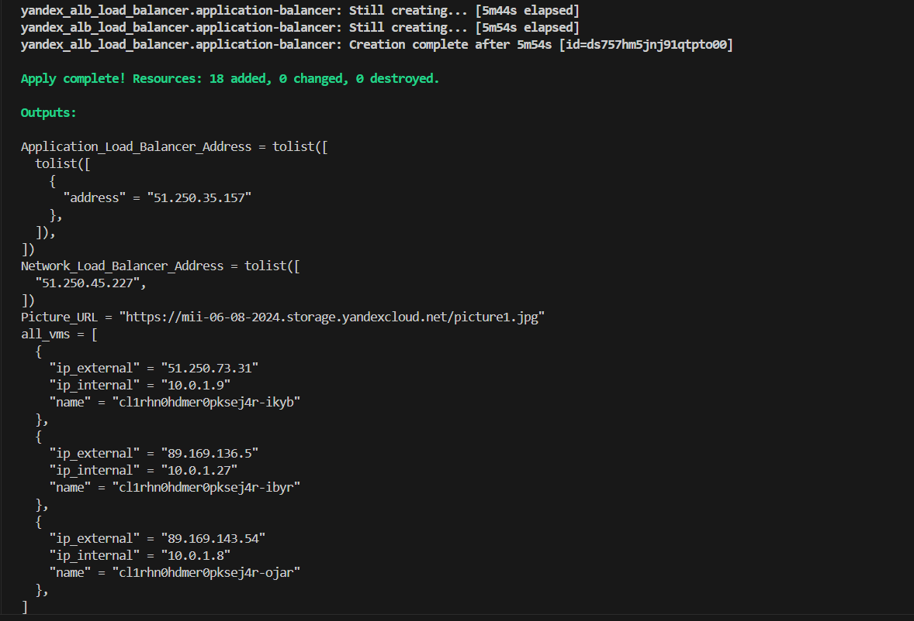
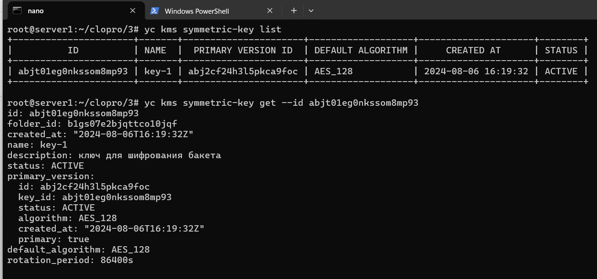
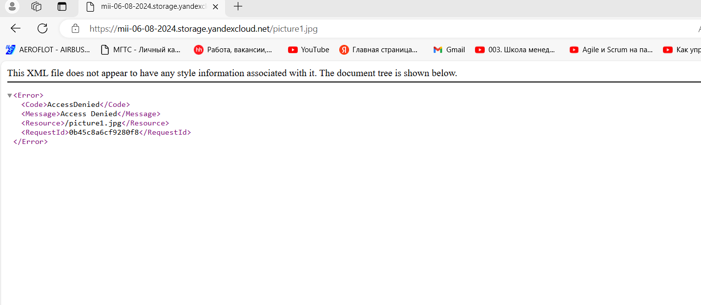
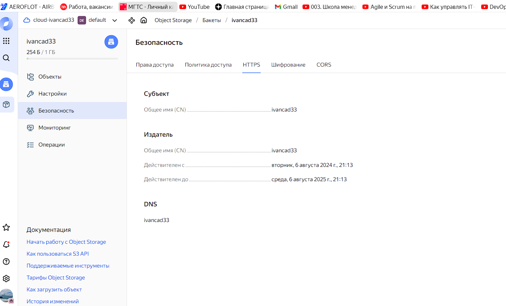
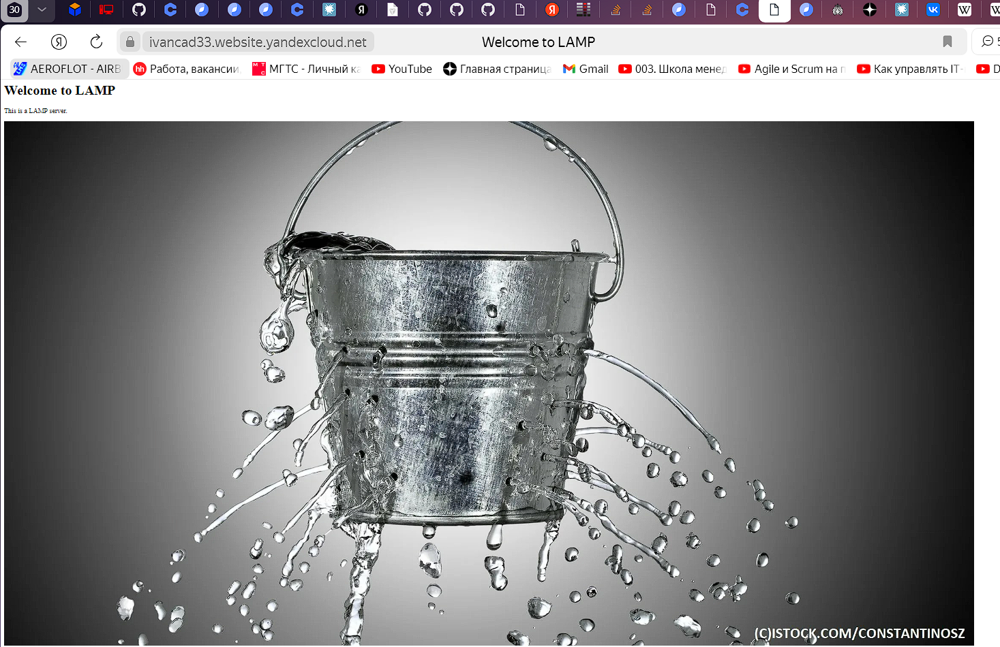

Используя конфигурации, выполненные в рамках предыдущих домашних заданий, нужно добавить возможность шифрования бакета.

---
## Задание 1. Yandex Cloud   

#### 1. С помощью ключа в KMS необходимо зашифровать содержимое бакета:

За основу взят терраформ манифест из предыдущего домашнего задания.

 
Cоздать ключ в KMS

Добавляем в `main.tf` ресурс `yandex_kms_symmetric_key` в соответствии с [документацией](https://yandex.cloud/ru/docs/kms/operations/key).

```tf
resource "yandex_kms_symmetric_key" "key-a" {
  name              = var.kms_key_name
  description       = var.kms_key_description
  default_algorithm = var.default_algorithm

}
```
Переменные указываем в `variables.tf`
```tf
variable "kms_key_name"  {
  type        = string
  default     = "kms-key"
}

variable "kms_key_description" {
  type        = string
  default     = "symmetric key for object storage"
}

variable "default_algorithm" {
  type        = string
  default     = "AES_128"
}

```

Также добавим соответствующие права сервисному аккаунту
```tf
resource "yandex_iam_service_account_static_access_key" "static-key" {
  service_account_id = yandex_iam_service_account.sa.id
  description        = "static access key for object storage"
}
```

C помощью ключа зашифровать содержимое бакета, созданного ранее.

В `yandex_storage_object` добавляем шифрование
```tf
  server_side_encryption_configuration {
         rule {
           apply_server_side_encryption_by_default {
             kms_master_key_id = yandex_kms_symmetric_key.secret-key.id
             sse_algorithm     = "aws:kms"
          }
     }
   }
}
```
Применяем изменения
```
terraform plan
terraform apply
```



Ключ шифрования создан.



Проверяем, что шифрование работает и картинка из интернета не доступна



Поскольку следующее домашнее задание по условиям должно выполняться не в терраформ, то получившиеся магнифесты прилагаю здесь:

[terraform ](https://github.com/Elfxf85/devops-netology/tree/main/clopro15.3/terraform)


#### 2. (Выполняется не в Terraform)* Создать статический сайт в Object Storage c собственным публичным адресом и сделать доступным по HTTPS:

Cоздать сертификат

К сожалению, ни один сертификат, созданный через пользовательский интерфейс валидацию не прошел, поэтому создаем сертификат  самостоятельно
```
openssl req -x509 -newkey rsa:4096 -nodes   -keyout key4.pem   -out cert4.pem   -days 365   -subj '/CN=ivancad33' -addext 'subjectAltName = DNS:ivancad33'
```
Также создаем соответствующую зону DNS

Cоздать статическую страницу в Object Storage и применить сертификат HTTPS

Конфигурацию статической страницы возьмем из предыдущего домашнего задания
```html
<html>
      <head><title>Welcome to LAMP</title></head>
      <body>
         <h1>Welcome to LAMP</h1>
         <p>This is a LAMP server.</p>
         
      </body>
      </html>
```

Вручную добавляем файлы сертификата `cert.pem` и `key.pem`



Через настройки обеспечиваем доступ к стартовой странице по адресу `https://ivancad33.website.yandexcloud.net/`

Проверяем доступность страницы с сертификатом в заголовке (замочек).



Полезные документы:

- [Настройка HTTPS статичного сайта](https://cloud.yandex.ru/docs/storage/operations/hosting/certificate).
- [Object Storage bucket](https://registry.terraform.io/providers/yandex-cloud/yandex/latest/docs/resources/storage_bucket).
- [KMS key](https://registry.terraform.io/providers/yandex-cloud/yandex/latest/docs/resources/kms_symmetric_key).


### Правила приёма работы

Домашняя работа оформляется в своём Git репозитории в файле README.md. Выполненное домашнее задание пришлите ссылкой на .md-файл в вашем репозитории.
Файл README.md должен содержать скриншоты вывода необходимых команд, а также скриншоты результатов.
Репозиторий должен содержать тексты манифестов или ссылки на них в файле README.md.
