# Домашнее задание к занятию «Кластеры. Ресурсы под управлением облачных провайдеров»

### Цели задания 

1. Организация кластера Kubernetes и кластера баз данных MySQL в отказоустойчивой архитектуре.
2. Размещение в private подсетях кластера БД, а в public — кластера Kubernetes.

---
## Задание 1. Yandex Cloud

#### 1. Настроить с помощью Terraform кластер баз данных MySQL.

Используя настройки VPC из предыдущих домашних заданий, добавить дополнительно подсеть private в разных зонах, чтобы обеспечить отказоустойчивость.

Берем VPC и публичную сеть из предыдущих домашних заданий и добавляем подсеть private с созданием подсетей в зонах `ru-central1-a` и `ru-central1-b`. 
```tf
resource "yandex_vpc_network" "my_vpc" {
  name                = var.VPC_name
}

resource "yandex_vpc_subnet" "public_subnet" {
  name                = var.subnet_name
  v4_cidr_blocks      = var.v4_cidr_blocks
  zone                = var.subnet_zone
  network_id          = yandex_vpc_network.my_vpc.id
}

resource "yandex_vpc_subnet" "private_subnet" {
  count               = length(var.private_subnet_zones)
  name                = "${var.private_subnet_name}-${var.private_subnet_zones[count.index]}"
  v4_cidr_blocks      = [cidrsubnet(var.private_v4_cidr_blocks[0], 4, count.index)]
  zone                = var.private_subnet_zones[count.index]
  network_id          = yandex_vpc_network.my_vpc.id
}
```
Определяем переменные
```tf
### Variables for VPC

variable "VPC_name" {
  type        = string
  default     = "my-vpc"
}

### Variables for Public subnet

variable "subnet_name" {
  type        = string
  default     = "public"
}

variable "v4_cidr_blocks" {
  type        = list(string)
  default     = ["192.168.10.0/24"]
}

variable "subnet_zone" {
  type        = string
  default     = "ru-central1-a"
}


### Variables for Private subnet

variable "private_subnet_name" {
  type        = string
  default     = "private"
}

variable "private_v4_cidr_blocks" {
  type        = list(string)
  default     = ["192.168.20.0/24"]
}

variable "private_subnet_zones" {
  type    = list(string)
  default = ["ru-central1-a", "ru-central1-b"]
}
```
Разместить ноды кластера MySQL в разных подсетях.

Ноды кластера создаются блоком `dynamic "host"` и размещаются в зонах доступности `ru-central1-a` и `ru-central1-b`
```tf
resource "yandex_mdb_mysql_cluster" "example" {
  name                = var.cluster_name
  environment         = var.cluster_env
  network_id          = yandex_vpc_network.my_vpc.id
  security_group_ids  = [yandex_vpc_security_group.my_security_group.id]
  version             = var.version_mysql
  deletion_protection = var.deletion_protection


  backup_window_start {
    hours   = var.hours
    minutes = var.minutes
  }

  maintenance_window {
    type = "ANYTIME"
  }

  resources {
    resource_preset_id = var.resource_preset_id
    disk_type_id       = var.disk_type
    disk_size          = var.disk_size
  }

  dynamic "host" {
    for_each = var.private_subnet_zones
    content {
      zone      = host.value
      subnet_id = element(yandex_vpc_subnet.private_subnet[*].id, index(var.private_subnet_zones, host.value))
    }
  }
}

```

 Необходимо предусмотреть репликацию с произвольным временем технического обслуживания.
```tf
  maintenance_window {
    type = "ANYTIME"
  }
```
Используем окружение Prestable, платформу Intel Broadwell с производительностью 50% CPU и размером диска 20 Гб.

Вышеуказанные параметры определены в `variables.tf`
```tf
variable "cluster_env" {
  type = string
  description = "Environment type: PRODUCTION or PRESTABLE"
  default     = "PRESTABLE"
}

variable "resource_preset_id" {
  type        = string
  default     = "b1.medium"
}
```
Класс хоста [b1.medium](https://yandex.cloud/ru/docs/managed-mysql/concepts/instance-types) удовлетворяет требуемым условиям  
 
Задаем время начала резервного копирования — 23:59.
```tf
backup_window_start {
    hours   = var.hours
    minutes = var.minutes
  }
```
Переменные `hours` и `minutes` определены в `variables.tf`
```tf
variable "hours" {
  type                     = number
  default                  = 23
}

variable "minutes" {
  type                    = number
  default                 = 59
}
```

Включить защиту кластера от непреднамеренного удаления.

Определяем переменную `deletion_protection`
```tf
variable "deletion_protection" {
  type        = bool
  default     = "true"
}
```
Далее указываем ее в настройках кластера в `main.tf`
```tf
deletion_protection = var.deletion_protection
```

Создать БД с именем `netology_db`, логином и паролем.
```tf
resource "yandex_mdb_mysql_database" "my_database" {
  name         = var.database_name
  cluster_id   = yandex_mdb_mysql_cluster.example.id
}

resource "yandex_mdb_mysql_user" "app" {
  cluster_id   = yandex_mdb_mysql_cluster.example.id
  name         = var.user_name
  password     = var.user_password
  permission {
    database_name = var.database_name
    roles         = var.user_roles
  }
}
```
Применяем изменения
```
terraform plan
terraform apply
```
Созданные ресурсы:

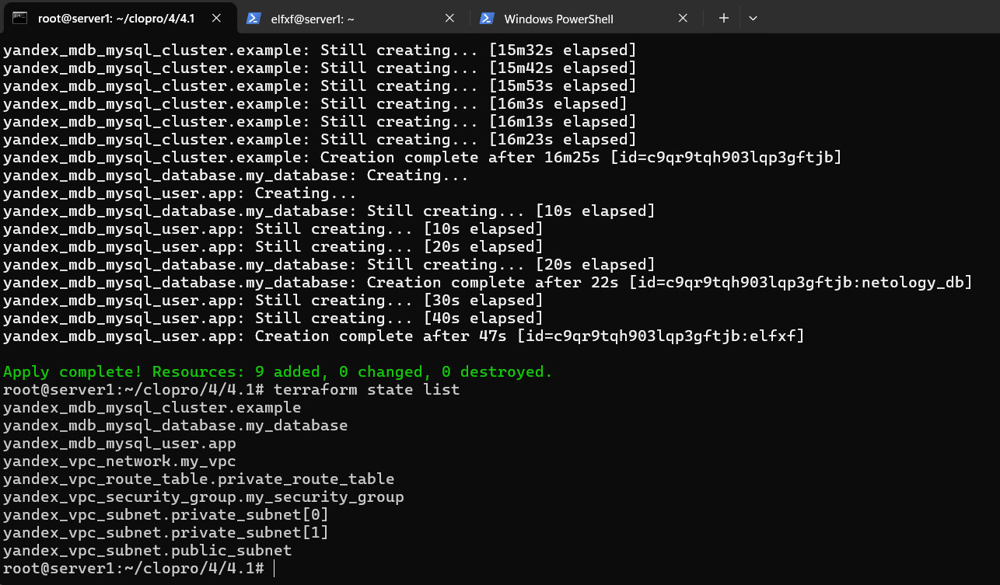

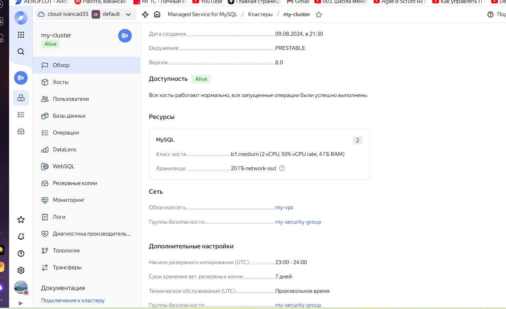

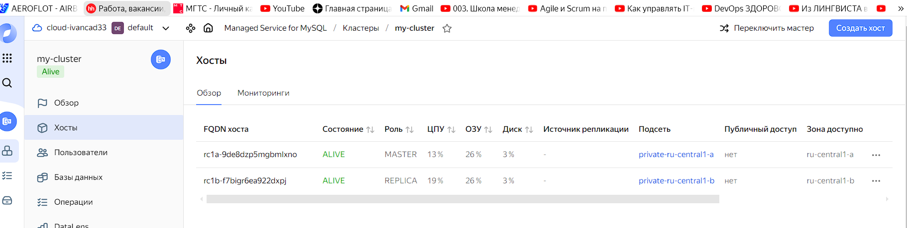

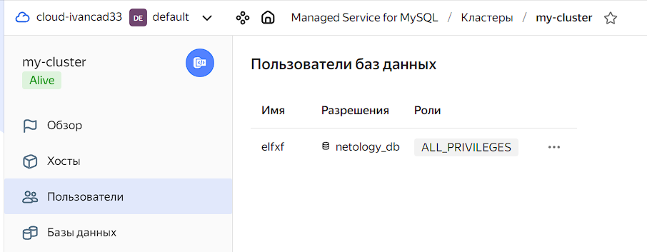

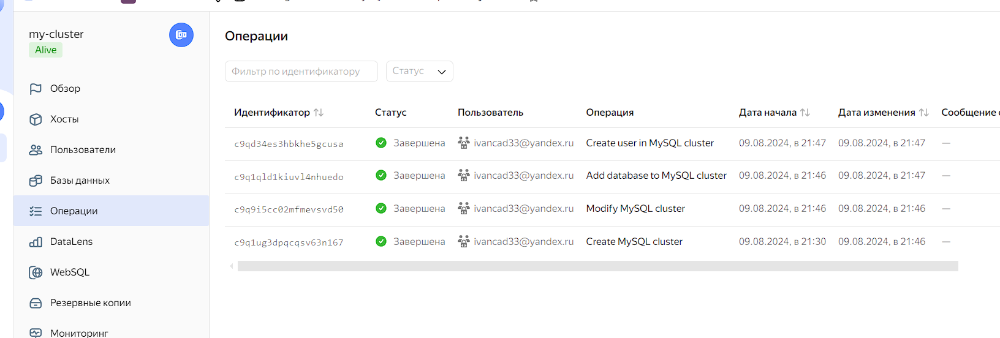

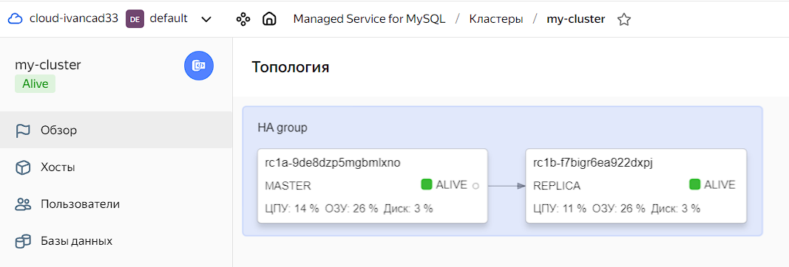

Полный файл с манифестом и переменными:

[main.tf](https://github.com)

[variables.tf](https://github.com/)


#### 2. Настроить с помощью Terraform кластер Kubernetes.

Используя настройки VPC из предыдущих домашних заданий, добавить дополнительно две подсети public в разных зонах, чтобы обеспечить отказоустойчивость.

Конфигурируем сеть public аналогично сети private в задании 1
```tf
resource "yandex_vpc_subnet" "public_subnet" {
  count = length(var.public_subnet_zones)
  name  = "${var.public_subnet_name}-${var.public_subnet_zones[count.index]}"
  v4_cidr_blocks = [
    cidrsubnet(var.public_v4_cidr_blocks[0], 4, count.index)
  ]
  zone       = var.public_subnet_zones[count.index]
  network_id = yandex_vpc_network.my_vpc.id
}
```
Создать отдельный сервис-аккаунт с необходимыми правами. 

Создаем сервис-аккаунт
```tf
resource "yandex_iam_service_account" "k8s_service_account" {
  name = var.k8s_service_account_name
}
```
Добавляем права, необходимые для создание и эксплуатацию k8s кластера
```tf
resource "yandex_resourcemanager_folder_iam_member" "k8s_service_account" {
  folder_id = var.folder_id
  role      = "editor"
  member    = "serviceAccount:${yandex_iam_service_account.k8s_service_account.id}"
}

resource "yandex_resourcemanager_folder_iam_member" "k8s_sa_k8s_node" {
  folder_id = var.folder_id
  role      = "k8s.clusters.agent"
  member    = "serviceAccount:${yandex_iam_service_account.k8s_service_account.id}"
}
```
Также в соответствии с [документацией](https://yandex.cloud/ru/docs/managed-kubernetes/operations/kubernetes-cluster/kubernetes-cluster-create) для использования публичного IP-адреса дополнительно назначьте роль vpc.publicAdmin.
```tf
resource "yandex_resourcemanager_folder_iam_member" "vpc-public-admin" {
  folder_id = var.folder_id
  role      = "vpc.publicAdmin"
  member    = "serviceAccount:${yandex_iam_service_account.k8s_service_account.id}"
}
```
 
Создать региональный мастер Kubernetes с размещением нод в трёх разных подсетях.
```tf
resource "yandex_kubernetes_cluster" "k8s_cluster" {
  name        = var.k8s_cluster_name
  description = "My Kubernetes Cluster"

  network_id               = yandex_vpc_network.my_vpc.id
  service_account_id       = yandex_iam_service_account.k8s_service_account.id
  node_service_account_id  = yandex_iam_service_account.k8s_service_account.id

    master {
    regional {
      region = "ru-central1"
      location {
        zone = "ru-central1-a"
        subnet_id = yandex_vpc_subnet.public_subnet[0].id
      }
      location {
        zone = "ru-central1-b"
        subnet_id = yandex_vpc_subnet.public_subnet[1].id
       }
      location {
        zone = "ru-central1-d"
        subnet_id = yandex_vpc_subnet.public_subnet[2].id
      }
     }
    }
```

Добавить возможность шифрования ключом из KMS, созданным в предыдущем домашнем задании.
```tf
resource "yandex_iam_service_account_key" "k8s_sa_key" {
  service_account_id = yandex_iam_service_account.k8s_service_account.id
}
```
 
Создать группу узлов, состояющую из трёх машин с автомасштабированием до шести.
```tf
resource "yandex_kubernetes_node_group" "k8s_nodes_a" {
  cluster_id = yandex_kubernetes_cluster.k8s_cluster.id
  name       = "${var.k8s_cluster_name}-node-group-a"

  instance_template {
    platform_id = "standard-v1"
    resources {
      memory = 4
      cores  = 2
    }
    boot_disk {
      size = 50
      type = "network-ssd"
    }
    network_interface {
      subnet_ids = [yandex_vpc_subnet.public_subnet[0].id]
    }
  }

  scale_policy {
    auto_scale {
      min     = 3
      max     = 6
      initial = 3
    }
  }

  allocation_policy {
    location {
      zone = "ru-central1-a"
    }
  }
}
```

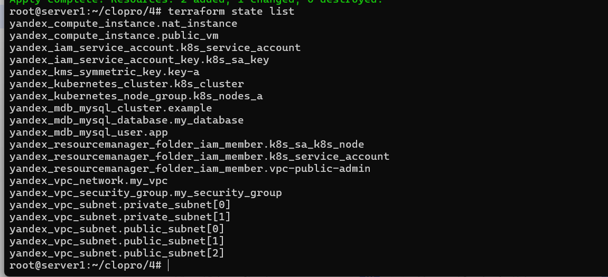

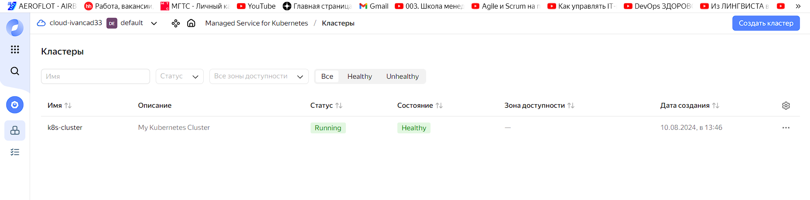

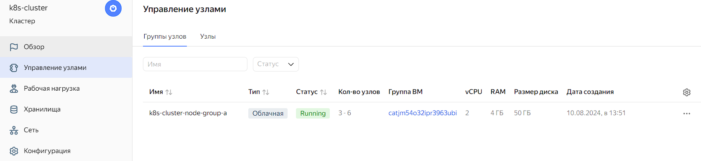


Подключиться к кластеру с помощью `kubectl`.

Подключаемся по внутреннему ip адресу c сервера public-vm, созданного в YC:
```
yc managed-kubernetes cluster get-credentials --id cat5i8ces60m62gjqhvr --internal

kubectl get nodes --kubeconfig /root/.kube/config
```

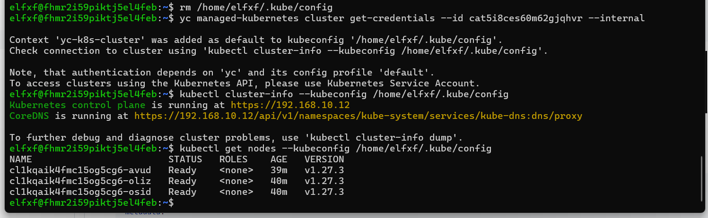

Запустить микросервис phpmyadmin и подключиться к ранее созданной БД.

Создаем файл `phpmyadmin-deployment.yaml`
```yml
apiVersion: apps/v1
kind: Deployment
metadata:
  name: phpmyadmin
  labels:
    app: phpmyadmin
spec:
  replicas: 1
  selector:
    matchLabels:
      app: phpmyadmin
  template:
    metadata:
      labels:
        app: phpmyadmin
    spec:
      containers:
      - name: phpmyadmin
        image: phpmyadmin/phpmyadmin:latest
        ports:
        - containerPort: 80
        env:
        - name: PMA_HOST
          value: rc1a-eiayqmru78vvuq1l.mdb.yandexcloud.net
        - name: PMA_PORT
          value: "3306"
        - name: PMA_USER
          value: "leo"
        - name: PMA_PASSWORD
          value: "741852Leo"
        - name: PMA_PMADB
          value: netology_db
```
Создаем сервис `phpmyadmin-service.yaml`
```yml
apiVersion: v1
kind: Service
metadata:
  name: phpmyadmin-service
spec:
  selector:
    app: phpmyadmin
  ports:
  - protocol: TCP
    port: 80
    targetPort: 80
    nodePort: 30002
  type: NodePort
```
Применяем изменения
```
kubectl apply -f  phpmyadmin-deployment.yaml
kubectl apply -f  phpmyadmin-service.yaml
```
Проверяем

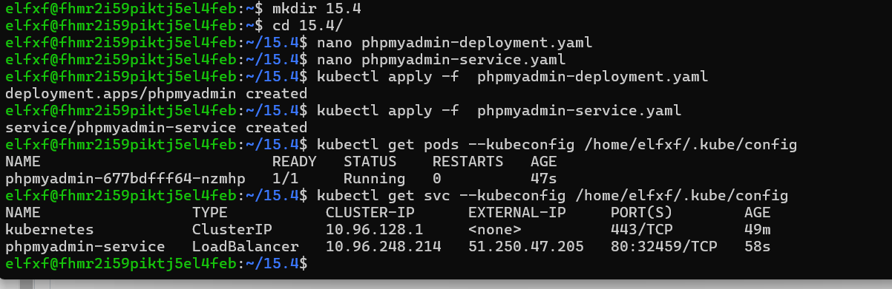

Проверяем ip адреса и пробуем подключиться к базе данных

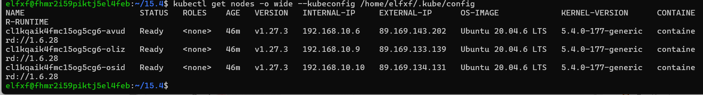

Подключение

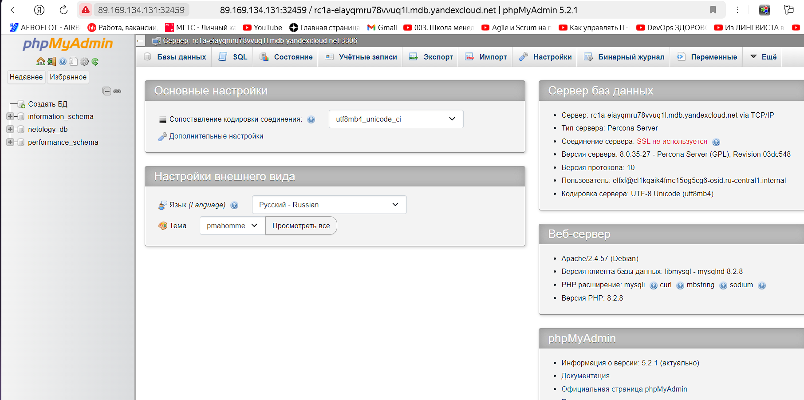

*Создать сервис-типы Load Balancer и подключиться к phpmyadmin. Предоставить скриншот с публичным адресом и подключением к БД.

Деплой не меняем, пересоздаем сервис в следующей конфигурации (меняем тип на LoadBalancer и убираем nodePort)
```yml

apiVersion: v1
kind: Service
metadata:
  name: phpmyadmin-service
spec:
  selector:
    app: phpmyadmin
  ports:
  - protocol: TCP
    port: 80
    targetPort: 80
#    nodePort: 30002
  type: LoadBalancer
```
Применяем изменения
```
kubectl apply -f  phpmyadmin-service.yaml
```
У сервиса появился внешний ip адрес

```
 51.250.47.205 
```

Подключаемся к базе данных

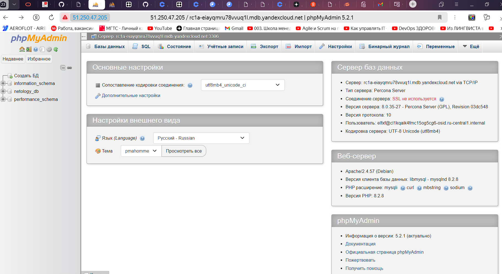

Файлы с манифестами:

[main.tf](https://github.com/)

[variables.tf](https://github.com/)

[phpmyadmin-deployment.yaml](https://github.com/Lf)

[phpmyadmin-service.yaml](https://github.com/)

-- 


### Правила приёма работы

Домашняя работа оформляется в своём Git репозитории в файле README.md. Выполненное домашнее задание пришлите ссылкой на .md-файл в вашем репозитории.
Файл README.md должен содержать скриншоты вывода необходимых команд, а также скриншоты результатов.
Репозиторий должен содержать тексты манифестов или ссылки на них в файле README.md.
